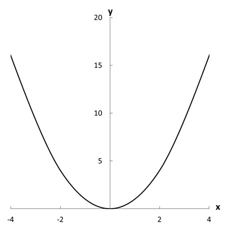
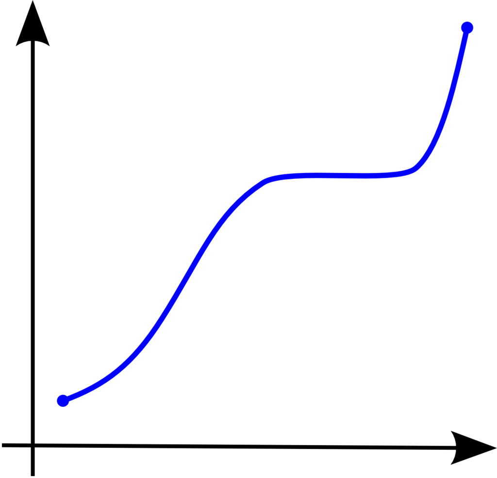
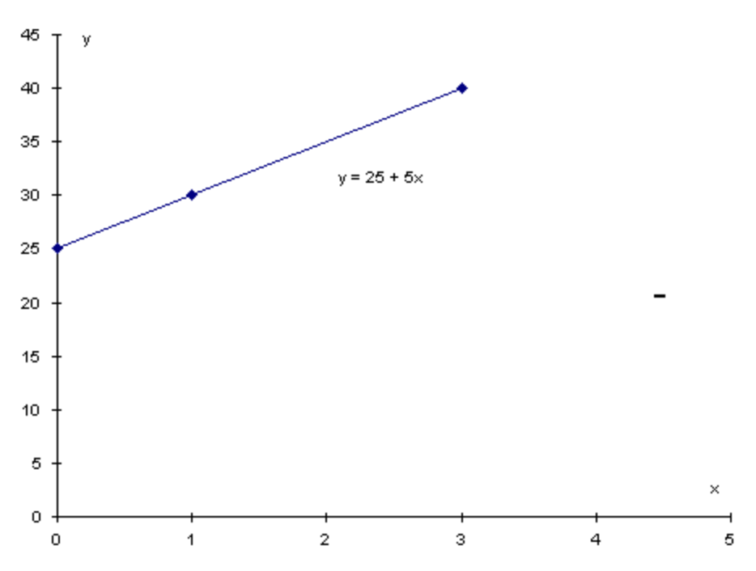
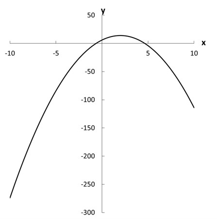
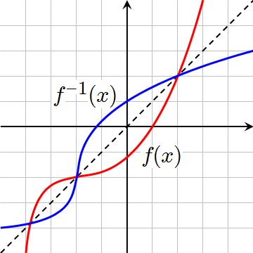

```{r setup, include=FALSE}
knitr::opts_chunk$set(echo = FALSE)
```

## Functions: Intro
Definition:

- A function describes the relationship between two or more concepts or variables (a mapping of one set to another).

$f(x)$ -- function _of_ x.

Commonly functions are visualized as producing an output (usually outputs are represented with $y$, $f(x)$, $g(x)$, etc.) when given an input (often $x$ is used to represent the inputs).


\includegraphics{images/Algebra_Functions.jpg}

## Functions are used in:

 * Game theory
    + Preferences and payoffs (utility functions).
 * Social sciences in general
    + Hypotheses building and testing.
    + Very common.

## Examples

1) $y=2x$ is a function because there is exactly one output, $y$, for every input, $x$.

2) \includegraphics{images/Algebra_Functions2.jpg} 

Note: The circle (a) is _not_ a function as each $x$-value is assigned to two $y$ values (as indicated by the red vertical line). The semicircles (b) and (c) are both functions. 

## Functions: Basic rules and concepts 

A function assigns only one value of $y$ to any $x$. Thus, for any value of $x$, there is one $y$ value that corresponds. However, any given value of $y$ can correspond to multiple values of $x$. For example:

$y = x^2$

Each value of $x$ produces one value of $y$. However, each value of $y$ (except $y = 0$) corresponds to two values of $x$: for instance, when $y = 4$, $x = 2$ or $x = -2$.

----

{ width=80% }


## Functions: Basic rules and concepts 

$f(x): A \rightarrow B$, where:

- A is the __domain__ -- the set of elements over which the function is defined

- B is the the __codomain__ -- the set from which values of $f(x)$ may be drawn 

$f(x) = x + 1$ 

or (equivalently) 

$y = x + 1$

If you input 4 as x, your output is 5.

In this function, $x$ is called the __input__, __independent__ or __exogenous__ variable. $y$ or $f(x)$ is the __output__, __dependent__ or __endogenous__ variable.

## Notation matters:

\includegraphics[width=10cm]{function-parts}

\hfill \tiny _Source_: mathisfun.com

## Identity and inverse function terms

\includegraphics[width=10cm]{FunctionT}

---

A function is \textbf{surjective or onto} if every value in the codomain is produced by some value in the domain.
A is surjective if $\forall b \in B, \exists a \in A \ni f(a) = b$ (for all b in B there exists an a in A such that the function of a is b).
$f:R \to R, f(x) = x$  vs. $f:(0,1) \to R, f(x) = x$. First function - surjective, because every point in R was reached by some point in the domain (the same point). The second was not surjective, as nothing outside (0, 1) in the codomain was reached.

A function is \textbf{injective or one-to-one} if each value in the range comes from only one value in the domain.
$\forall a, c \in A, \quad \forall b \in B, \quad if \quad f(a) = b \quad and \quad f(c) = b, \quad then \quad a = c$.
$f:R \to R, f(x)=x^2$ - not injective. For example, $y = 4$ is the result of plugging both $x = 2$ and $x = -2$ into the function (it would be injective if we confined ourselves to real numbers no less than zero, though).

If a function is both injective and surjective (one-to-one and onto), then it is \textbf{bijective}. A bijective function is \textbf{invertible}, and so has an inverse.


## Monotonic function

- Definition: a function of one variable, defined on a subset of the real numbers, whose increment $\triangle f(x) = f(x\prime) - f(x\prime)$, for $\triangle x = x\prime - x>0$, does not change sign, that is, is either always negative or always positive.

- Strictly/weakly increasing or decreasing functions.

- Examples of monotonic and non-monotonic functions.

## Monotonic Function Terms

\includegraphics[width=10cm]{Monotonic}

## Example

{ width=60% }

## Linear function

- Definition: The linear equation (affine equation) states that the size of the impact of $x$ on $y$ is constant across all values of $x$.

- Linear functions are those whose graph is a straight line.

A linear function has the following form:

$$f(x) = a + bx$$

A linear function has one independent variable and one dependent variable. The independent variable is $x$ and the dependent variable is $y$.

$a$ is the constant term or the y intercept. It is the value of the dependent variable when $x = 0$.

$b$ is the coefficient of the independent variable. It is also known as the slope and gives the rate of change of the dependent variable.


## Example: 

According to Shaffer (1981), the probability that voters participate
in a US presidential election is a linear function of education:

Probability of voting $= a+b(edu.)$

Probability of voting $= 1.215 + 0.134 * edu$

Shaffer uses four levels of education: 0-8 years of education, 9-11
years, 12 years, and more than 12 years

Conclusion: with each level of education, the probability of voting increases by ~.13.

## Graphing a linear function
To graph a linear function:

1. Find 2 points which satisfy the equation.

2. Plot them.

3. Connect the points with a straight line.

## Example: 


\fontsize{8pt}{7.2}\selectfont


$y = 25 + 5x$

let $x = 1$

then 

$y = 25 + 5(1) = 30$

let $x = 3$

then 

$y = 25 + 5(3) = 40$


{ width=50% }  

## Another example:


A company receives $45 for each unit of output sold. It has a variable cost of $25 per item and a fixed cost of $1600. 

What is its profit if it sells (a) 75 items, (b)150 items, and (c) 200 items?

 
R(x) = 45x	
C(x) = 1600 + 25x

P(x) = 45x -(1600 + 25x)= 20x - 1600	 
       
- let x = 75	P(75) = 20(75) - 1600 = -100        a loss

- let x = 150	P(150) = 20(150) - 1600 = 1400

- let x = 200	P(200) = 20(200) - 1600 = 2400

\hfill \tiny _Source_: www.columbia.edu

## Linear functions: features

- Defined by additivity and scaling

__Additivity__ (superposition): $f(x_{1}+x_{2})=f(x_{1})+f(x_{2})$

- The impact of a sum of variables is equivalent to the sum of the impacts of those variables

__Scaling__ (homogeneity): $f(cx) = cf(x)$ ($c$ is constant)

- The size of the input is proportional to the size of the output

$f(x)=ax$ (where $a$ is the slope of the function)

## Linear equation vs. linear function

\textbf{A linear equation} is an equation that contains only terms of order $x^1$ and $x^0 = 1$.

\textbf{A linear function} is characterised by additivity and scaling.

Linear function: $y = f(x) = \beta x$.

$f(x_1 + x_2) = \beta (x_1 + x_2) = \beta x_1 + \beta x_2, \quad \beta x_1 + \beta x_2 = f(x_1) + f(x_2)$.

Linear equation: $y = f(x) = \alpha + \beta x$.

$f(x_1 + x_2) = \alpha + \beta (x_1 + x_2) = \alpha + \beta x_1 + \beta x_2$,
$f(x_1) + f(x_2) = (\beta x_1 + \alpha) + (\beta x_2 + \alpha)$,
$\alpha + \beta x_1 + \beta x_2 \neq 2\alpha + \beta x_1 + \beta x_2$

## Nonlinear functions: exponents

\textbf{Exponents (aka power functions)} are a shorthand for expressing the multiplication of a number by itself: $x^n = x \times x \times x ... \times x \quad (n \quad times)$.

$x^{-n} = \frac {1} {x^n}$.

$x^{\frac{2} {3}} = \sqrt[3]{x^2}$. Consider $f(x) = x^2$. Non-linear relation: the slope of the curve for $y = x^2$ is not constant: the impact of x on y changes as we move along the x-axis (i.e., consider different values of x).


---

\textbf{Multiplication}: $x^m \times x^n = x^{m + n}$.

$x^m \times z^n = (xz)^m$.

$x^m + z^n \neq (xz)^{m+n}$.

$(x^m)^n = x^{mn}$.

$\frac {x^m} {x^n} = x^{m-n} = x^m \times x^{-n}$

$\frac {x^m} {z^m} = (\frac {x} {z})^m$.

The exponential function: not $x^a$, but $a^x$. The most commonly used exponential function: $a=e$, where $e$ is the base of the natural logarithm, $e \approx 2.7183$. 
$y = exp(x) = e^x$. 


## Graph of the exponential function

\begin{center}
\includegraphics[width=10cm]{Expon}
\end{center}

## Exercises

1) Simplify $x^{-2} \times x^3$.

2) Simplify $(b \cdot b \cdot b) \times c^{-3}$.

3) Simplify $((qr)^{\gamma})^{\delta}$.

4) Solve $x - xe^{5x+2}=0$.

5) Solve $5(x^2-4)=(x^2-4)e^{7-x}$.

## Logarithms 

\textbf{Logarithms} can be understood as the inverses of exponents (and vice versa). They can be used to transform an exponential function to a linear one, or a linear function to a nonlinear one in which the impact of one variable on another declines as the first variable rises in value.
$\log_a x, \quad a > 0, \quad a \neq 1$.
$a^{\log_a x} = x \quad and \quad \log_a a^x = x$.

Logs can be written in any base, though the most common are base 10 and the natural log ($ln (x)$).

$ln(1)=0, \quad ln(x) = 0 \quad when \quad x = 1, \quad ln(x) < 0 \quad when \quad 0 < x < 1$.
$ln(x_1 \times x_2) = ln(x_1) + ln(x_2), \quad x_1, x_2 > 0$.
$ln(\frac {x_1} {x_2}) = ln(x_1) - ln(x_2), \quad x_1, x_2 > 0$.
$ln(x_1 + x_2) \neq ln(x_1) + ln(x_2), \quad for \quad x_1, x_2 > 0$.
$ln(x_1 - x_2) \neq ln(x_1) - ln(x_2), \quad for \quad x_1, x_2 > 0$.
$ln(x^b) = bln(x), \quad for \quad x>0$.
$ln(1+x) \approx x, \quad x>0 \quad and \quad x \approx 0$.

## Graph of the natural logarithm function

\begin{center}
\includegraphics[width=10cm]{Ln}
\end{center}

## Exercises

1) Simplify into one term $ln(3x) - 2ln(x+2)$.

2) Rewrite the following by taking the log of both sides. Is the result a linear (affine) function?
$y = \alpha \times {x_1}^{\beta1} \times {x_2}^{\beta2} \times {x_3}^{\beta3}$.

3) Solve $2ln(\sqrt{x}) - ln(1-x) = 2$.

4) Solve $\log_{10} (x) + \log_{10} (x-3) = 1$.

5) Solve $3+2ln(\frac {x}{7}+3)=(-4)$.

## Solution to the second exercise

$ln(y) = ln(\alpha) + \beta1ln(x_1) +\beta2ln(x_2) + \beta3ln(x_3). \quad Yes.$ Two rules were used: 
$ln(xy)=ln(x + ln(y) \quad ln(x^a)=aln(x)$.

## Radicals (or Roots)

Roots (sometimes called radicals) are those numbers represented by the radical symbol: $\sqrt[n]{x}$. They are (almost) the inverse functions of x raised to the power n: $\sqrt[n]{x^n} = x, \quad as \quad long \quad as \quad n=2k \quad or \quad x \geq 0$. Functions with radicals are nonlinear: $y=\sqrt[n]{x}$.

$\sqrt[n]{x^p} = x^{\frac {p} {n}}$.
$\sqrt[n]{x} + \sqrt[n]{x} \neq \sqrt[n]{x+x}, \quad n > 1$.
$\sqrt[a]{x} + \sqrt[b]{y} \neq \sqrt[a+b]{x+y}, \quad a,b > 1$.
$\sqrt[n]{x} + \sqrt[n]{z} = \sqrt[n]{xz}, \quad n > 1$.
$\sqrt[a]{x} + \sqrt[b]{z} \neq \sqrt[ab]{xz}, \quad a,b > 1$.
$\frac {\sqrt[n]{x}} {\sqrt[n]{z}} = \sqrt[n]{\frac {x} {z}}, \quad for \quad n > 1$.
$\frac {\sqrt[a]{x}} {\sqrt[b]{z}} \neq \sqrt[a+b]{\frac {x} {z}}, \quad for \quad a \neq b \quad and \quad a, b > 1$.

## Exercises

1) Simplify $\sqrt{x} \quad \times \quad \sqrt[5]{x}$.

2) Simplify $\sqrt[2]{294x^4}$.

3) Simplify $\sqrt[5]{-486x^2y^6}$.

4) Simplify $\sqrt[3]{a^4} - \frac {\sqrt[3]{a^2}} {\sqrt[3]{a^{-1}}} + \sqrt[3]{\frac {27} {a^{-1}}}$.

5) Write as a simple radical and simplify: $\frac {\sqrt[2]{(2x-3)^3} \cdot \sqrt[4]{2x-3}} {\sqrt[3]{(2x-3)^4}}$.

## Nonlinear functions: quadratic

$$f(x)=ax^2+bx+c$$

- Quadratic functions are generally used when you believe that the rate of increase in some variable is itself increasing

Example: Muller and Seligson (1987) on rebellion and government control

- Rebellion will be low in countries that exert very little or very high government coercion 
 
$$r=\alpha+\beta_1c-\beta_2c^2$$


where, $r$ is rebellion and $c$ is coercion


----

{ width=80% } 

## Graph of a cubic polinomial

\begin{center}
\includegraphics[width=10cm]{Cubic}
\end{center}

## Function transformation:

__Addition__:

$$(f+g)(x) = f(x) + g(x)$$
Example: $f(x) = 2x+4$ and $g(x) = x^2$

$(f+g)(x) = (2x+4) + (x^2) = x^2+2x+3$


__Subtraction__:

$$(f-g)(x) = f(x) - g(x)$$

__Multiplication__:

$$(f\cdot g)(x) = f(x) \cdot g(x)$$

Example: $f(x) = 2x+3$ and $g(x) = x^2$

$(f\cdot g)(x) = (2x+3)\cdot(x^2) = 2x^3 + 3x^2$

## Inverse function

- Definition: the inverse of a function has all the same points as the original function, except that the x's and y's have been reversed

$f ^{{}^{\_}1} (f(x)) = x$ 

{ width=40% }

## Let's practice

Find the inverse of $y = 3x - 2$.

----

The inverse of $y = 3x - 2$:

\begin{center}
$y=3x-2$

$y+2=3x$

$\frac{y+2}{3}=x$

$x=\frac{y+2}{3}$

$f^{-1}(y)=\frac{y+2}{3}$

\end{center}


## Problems:

1) What is the inverse of the function $f(x) = 5x - 4$?

2) What is the inverse of the function $f(x) = \frac{1}{2}(3x + 4)$?

3) Find the inverse of $f(x)=3x +4$.

## 1) What is the inverse of the function $f(x) = 5x - 4$


Change "y" for "f(x)": $y = 5x - 4$

Add $4$ to both sides: $y + 4 = 5x$

Divide both sides by $5$: $\frac{y + 4}{5} = x$

Swap sides: $x = \frac {y + 4}{5}$
                    
The result: $f^{-1}(y) =\frac {y + 4}{5}$


## 2) What is the inverse of the function $f(x) = \frac{1}{2}(3x + 4)$?

$y = \frac{1}{2}(3x + 4)$

Multiply by $2$: $2y = 3x + 4$

We get to: $3x = 2y - 4$

Divide by $3$: $x = \frac{1}{3}(2y - 4)$

Optional: extract $2$: $x = \frac{2}{3}(y - 2)$


So: $f^{-1}(y)= \frac{2}{3}(y - 2)$


## Function composition

Definition: function composition is the pointwise application of one function to the result of another to produce a third function.

- To put it simply: __function composition__ is applying one function to the results of another

$(g o f)(x)$ or $g(f(x))$ --  $g$ composed with $f$ or more commonly $g$ of $f$ of $x$. 


## How do you find the composition of two functions?

Here are the steps we can use to find the composition of two functions:

Step 1: Rewrite the composition in a different form. For example, the composition $(fog)(x)$ needs to rewritten as $f(g(x))$.

Step 2: Replace each occurrence of $x$ found in the outside function with the inside function. For
example, in the composition of $(f og)(x) = f(g(x))$, we need to replace each $x$ found in $f(x)$, the outside function, with $g(x)$, the inside function.


Step 3: Simplify the answer.

- How does it work?

Lets say, $f(x) =5x+3$ and $g(x) = x^2$, then

$g(f(x))$ = $(5x+3)^2$ 

## Practice

1) Given $f(x) = 2x + 3$ and $g(x) = -x^2 + 6$, find (g o f)(x).


2) Given $f(x) = \frac {x}{x+1}$ and $g(x) = 9x-3$, find (g o f)(x).


3) Given $f(x) = 3x^2 + 2x - 5$ and $g(x) = 2x - 3$, find (f o g) (x) and (g o f) (x).


4) Simplify $h(x)=g(f(x)), \quad where \quad f(x) = x^2 + 2 \quad and \quad g(x) = \sqrt[2]{x-4}$. 


----

## 1) Given $f(x) = 2x + 3$ and $g(x) = -x^2 + 6$, find (g o f)(x):


\begin{center}
$(g o f )(x) = g( f(x))$

   $= g(2x + 3)$
   
  $= -(...)2 + 6$   
    
   $= -(2x + 3)^2 + 6$
   
   $= -(4x^2 + 12x + 9) + 5$
   
  $= -4x^2 - 12x - 9 + 6$
  
  $= -4x^2 - 12x - 3$
\end{center}


## 2) Given $f(x) = \frac {x}{x+1}$ and $g(x) = 9x-3$, find (g o f)(x):


\includegraphics[width=12cm]{gof1}


## 3) Given $f(x) = 3x^2 + 2x - 5$ and $g(x) = 2x - 3$, find (f o g) (x) and (g o f) (x)

\begin{center}
\includegraphics[width=12cm]{gof2}
\end{center}
  

