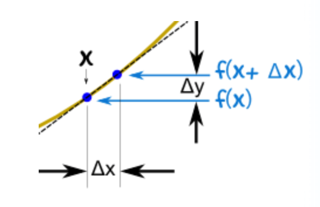
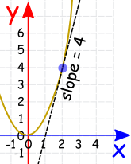
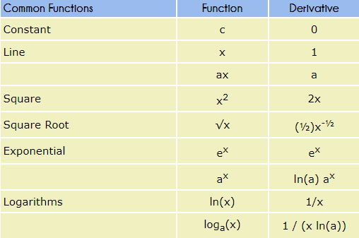
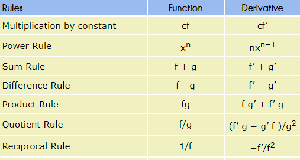

```{r setup, include=FALSE}
knitr::opts_chunk$set(echo = FALSE)
```

## Intro

Definition: 

- The derivative helps to understand the slope of the line, the instantaneous rate of change of a function.

- The derivative of a function $f$ at a point	$x$, written $f'(x)$, is given by:


$$f'(x) = \lim_{\triangle x\to\infty} \frac{f(x+\triangle x) - f(x)} {\triangle x}$$

if the limit exists.

Sometimes the derivative is written like this:

$$\frac{dy}{dx} = \lim_{\triangle x\to\infty} \frac{f(x+\triangle x) - f(x)} {\triangle x}$$
The process of finding a derivative is called __differentiation__.

## Why is it useful?

__Differentiation__, i.e. calculating the rate of change, has applications to nearly all quantitative disciplines, whether it's natural or social science.

- Social scientists use differentiation and rate to determine how people, goods, and processes change due to the change of an independent variable (boundless.com).

- For example, differentiation is useful when we study the changes in 1) the GDP; 2) the flow of traffic; 3) the fertility rate affect any kind of social-economic dimensions.

__Financial derivatives__ are contracts between two parties that specify conditions (especially the dates, resulting values and definitions of the underlying variables, the parties' contractual obligations, and the notional amount) under which payments are to be made between the parties (wiki). 

- Some of the more common derivatives include forwards, futures, options, swaps, and variations of these.

----

## What does it all mean in mathematical terms?

To put it simply, to find the derivative of a function $y = f(x)$ we use the slope formula:

Slope =  Change in $Y$ / Change in $X$ =  $\frac {\triangle y} {\triangle x}$

{ width=40% }  


Here we see that:

$x$ changes from $x$	to	$x+\triangle x$

$y$ changes from $f(x)$	to	$f(x+\triangle x)$

----

Now follow these steps:

- Fill in this slope formula:  $\frac{\triangle y}{\triangle x} =  \frac{f(x+\triangle x) - f(x)} {\triangle x}$

- Simplify it as best as you can

- Then make $\triangle x$ shrink towards zero.


## Let's try an example: 

__Problem: the function $f(x) = x^2$, let's find the derivative of $x^2$ (or $\frac{d}{dx}x^2$).__

We know $f(x) = x^2$, and can calculate $f(x+\triangle x)$:

Start with: $f(x+\triangle x) = (x+\triangle x)^2$

Expand $(x + \triangle x)^2$:	 	$f(x + \triangle x) = x^2 + 2x \triangle x + (\triangle x)^2$


The slope formula is: $$\frac{f(x+\triangle x) - f(x)} {\triangle x}$$

1) Put in $f(x+\triangle x)$ and $f(x)$: $\frac{x^2+2x \triangle x + (\triangle x)^2 - x^2} {\triangle x}$


2) Simplify ($x^2$ and $-x^2$ cancel each other out): $\frac{2x \triangle x + (\triangle x)^2 } {\triangle x}$


3) Simplify more (divide through by $\triangle x$): $= 2x + (\triangle x)^2$


4) as $\triangle x$ heads towards $0$:	$= 2x$

__Result__: the derivative of $x^2$ is $2x$

-----

Too put it simply, this means that, for the function $x^2$, the slope or "rate of change" at any point is $2x$.

For example, when $x=2$ the slope is $2x = 4$

Let's represent it graphically:

{ width=40% } 


-----

Let's use the <https://www.mathsisfun.com/calculus/derivative-plotter.html> for more visualizations


## Let's practice:


__Problem: the function $f(x) = x^3$, let's find the derivative of $x^3$ (or $\frac{d}{dx}x^3$).__


- Hint: keep in mind the slope formula: $\frac{\triangle y}{\triangle x} =  \frac{f(x+\triangle x) - f(x)} {\triangle x}$


## Solution:


We know $f(x) = x^3$, and can calculate $f(x+\triangle x)$:


Start with:	$f(x+\triangle x)$ = $(x+\triangle x)^3$


Expand $(x+\triangle x)^3$:	 	$f(x+\triangle x) = x^3 + 3x^2 \triangle x + 3x (\triangle x)^2 + (\triangle x)^3$


Again, we use the slope formula: $$\frac{f(x+\triangle x) - f(x)} {\triangle x}$$


1) Put in $f(x+\triangle x)$ and $f(x)$: $\frac{x^3 + 3x^2 \triangle x + 3x (\triangle x)^2 + (\triangle x)^3 - x^3} {\triangle x}$


2) Simplify ($x^3$ and $-x^3$ are cancelled): $\frac{3x^2 + 3x (\triangle x)^2 + (\triangle x)^3 } {\triangle x}$


3) Simplify more (divide through by $\triangle x$): $= 3x^2 + 3x \triangle x+ (\triangle x)^2$


4) as $\triangle x$ heads towards $0$:	$= 3x^2$

Result: The derivative of $x^3$ equals $= 3x^2$

## Problems:


1) Find $\frac{d}{dx}(x^2 + 5x)$

2) Find $\frac{d}{dx}(2x^3)$

3) Find $\frac{d}{dx}(x^3 - 3x)$


## 1) Find $\frac{d}{dx}(x^2 + 5x)$

So $f(x+\triangle x) = (x+ \triangle x)^2 +5(x+\triangle x) = x^2 +2x\triangle x + (\triangle x)^2+ 5x+ 5\triangle x$

The slope formula: $\frac{\triangle y}{\triangle x} =  \frac{f(x+\triangle x) - f(x)} {\triangle x}$

$=\frac{x^2 + 2x \triangle x +(\triangle x)^2 + 5x + 5\triangle x - (x^2+5x)} {\triangle x}$

$=\frac{x^2 + 2x \triangle x +(\triangle x)^2 + 5x + 5\triangle x - x^2+5x} {\triangle x}$

$=\frac{2x \triangle x +(\triangle x)^2 + 5\triangle x} {\triangle x}$


$=2x+\triangle x+5$

As $\triangle x$ heads towards $0$, the result is: $\frac{d}{dx}(x^2 + 5x)= 2x+5$ 


## 2) Find $\frac{d}{dx}(2x^3)$

$f(x)=(2x^3)$

So $f(x+\triangle x) = 2(x+ \triangle x)^3 = 2(x^3 +3x^2\triangle x + 3x(\triangle x)^2+(\triangle x)^3)$ 

= $2x^3 + 6x^2\triangle x + 6x(\triangle x)^2 + 2(\triangle x)^3$

Let's bring in the slope formula:  $\frac{\triangle y}{\triangle x} =  \frac{f(x+\triangle x) - f(x)} {\triangle x}$


$= \frac{2x^3 + 6x^2\triangle x + 6x(\triangle x)^2 + 2(\triangle x)^3 - 2x^3}{\triangle x}$


Now, let's simply this: $=6x^2+6x\triangle x+2(\triangle x)^2$

As $\triangle x$ heads towards $0$, the result is: $\frac{d}{dx}(2x^3)= 6x^2$ 


## 3) Find $\frac{d}{dx}(x^3 - 3x)$


$f(x)=x^3 - 3x$

So $f(x+\triangle x) = (x + \triangle x)^3 - 3(x +\triangle x)$

$= x^3 +3x^2\triangle x + 3x(\triangle x)^2+(\triangle x)^3 - 3x - 3\triangle x$ =

The slope formula: $\frac{\triangle y}{\triangle x} =  \frac{f(x+\triangle x) - f(x)} {\triangle x}$

$=\frac{x^3 +3x^2\triangle x + 3x(\triangle x)^2+(\triangle x)^3 - 3x - 3\triangle x - (x^3 - 3x)}{\triangle x}$


$=\frac{x^3 +3x^2\triangle x + 3x(\triangle x)^2+(\triangle x)^3 - 3x - 3\triangle x - x^3 + 3x}{\triangle x}$

$=\frac{3x^2\triangle x + 3x(\triangle x)^2+(\triangle x)^3 - 3\triangle x}{\triangle x}$

$3x^2  + 3x \triangle x+(\triangle x)^2 - 3$

As $\triangle x$ heads towards $0$, the result is: $\frac{d}{dx}(x^3 - 3x)= 3x^2 - 3$ 

## Multivariate functions and the partial derivative

Derivation applies to equations with more than a variable. Consider the equation $f(x,z)=3z^3-3z^2+\sqrt{z}+x$. Say we want to know how y changes with x, holding z constant. This is knows as taking the \textbf{the partial derivative} - $\frac {\partial} {\partial_x}f(x,y)$ or simply $\partial_x$. It means the following: treat every variable other than x as a constant, and just take the derivative with respect to x.
$\frac {\partial} {\partial_x}f(x,z)=1$.

Marginal effects. $y = \beta_0 + \beta_1 x + \beta_2 z + \beta_3 xz$. Partial derivative with respect to x: 
$\frac {\partial} {\partial_x}f(x,z)=\beta_1 + \beta_3z$.

## Exercises

1) Find the partial derivative with respect to x: $f(x,z)=3z^2-z+1$.

2) Find the partial derivative with respect to x: $f(x,z)=3zx + 2z + 2z^2x^3$.

3) Find the partial derivative with respect to z: $f(x,y,z)=11z+3x^2y+5x^2z+7z^2y$.

4) Find the partial derivative with respect to z: $f(x,y,z)=4x^2y^2z^2+8xyz+12xy+14x$.

5) Find the partial derivative with respect to z: $f(x,y,z)=8xyz^2+10x^2y^2+12x^2y+14x^2z^2.$

## Derivative Rules

Luckily, we don't have to use the slope formula all the time!

{ width=80% } 

## Derivative Rules


{ width=80% } 


## How can we use the derivative rules?


Example: What is the derivative ($\frac{d}{dx}$) of $x^2+x^3$?

The sum rule says:

The derivative of $f + g = f' + g'$

So we can take care of each derivative separately and then add them.

We use the power rule:

$\frac{d}{dx}x^2 = 2x$

$\frac{d}{dx}x^3 = 3x^2$

The result:


The derivative of $x^2 + x^3 = 2x + 3x^2$

## Let's practice:

1) What is $\frac{d}{dx}(4x^2)$?

2) What is $\frac{d}{dx}(x^3 - 3x^2)$?

3) What is $\frac{d}{dx}(6x^4 - 3x^5 + 5x^6)$?

4) Find the derivative of y with respect to x: $y=5x^5+4x^4+3x^3+2x^2+x+1$.

5) Find the derivative of y with respect to x: $y=7x^4-9x^3+5x+117$.

6) Find the derivative of y with respect to x: $y=27x^3+5x^2-x+13$.


## 1) What is $\frac{d}{dx}(4x^2)$?


The multiplication by constant rule: $cf = cf'$

This means that the derivative of $4f$ is $4f'$


Next, we know from the power rule:

$\frac{d}{dx}(x^2)$ = $2x^{2-1} = 2x^1 = 2x$

The results is:

$\frac{d}{dx}(4x^2) = 4 X 2x = 8x$

## 2) What is $\frac{d}{dx}(x^3 - 3x^2)$?


The difference rule:

The derivative of $f - g = f' - g'$


Now let's use the power rule:

1) $\frac{d}{dx}(x^3) = 3x^{3-1} = 3x^2$

2) $\frac{d}{dx}(x^2) = 2x^{2-1} = 2x$ meaning that $\frac{d}{dx}(3x^2)  = 3 X 2x = 6x$

Now we can solve the problem: 


$\frac{d}{dx}(x^3 - 3x^2) = 3x^2 - 6x$

## 3) What is $\frac{d}{dx}(6x^4 - 3x^5 + 5x^6)$?


Use the power rule:

$\frac{d}{dx}(x^4) =4x^{4-1} = 4x^3$, therefore $\frac{d}{dx}(6x^4) = 6 X 4x^3 = 24x^3$

$\frac{d}{dx}(x^5) =5x^{5-1} = 5x^4$, therefore $\frac{d}{dx}(3x^5) = 3 X 5x^4 = 15x^4$

$\frac{d}{dx}(x^6) =6x^{6-1} = 6x^5$, therefore $\frac{d}{dx}(5x^6) = 5 X 6x^5 = 30x^5$

The final answer: $\frac{d}{dx}(6x^4 - 3x^5 + 5x^6) =24x^3 - 15x^4 + 30x^5$

## More on the rules for differentiation

1) The derivative is a linear operator: 
$\frac {d(f+g)}{dx} = \frac {df}{dx} + \frac {dg}{dx}$.
$\frac {d(cf)}{dx} = c\frac {df}{dx}$.

2) Chain rule: 
$(g(f(x)))\prime = g\prime(f(x))f\prime(x)$.

Examples:
$f(x)=2x^2 \quad g(x)=e^x, \quad h(x) = g(f(x)). \quad h\prime(x)=g\prime(u)f\prime(x) = e^u(4x) = 4xe^{2x^2}$.
$g(x)=x^2 \quad f(x)=2x-a, \quad h(x)=g(f(x))=(2x-a)^2. \quad h\prime(x)=g(f(x))\prime=g\prime(f(x))f\prime(x)=2(2x-a)(2)=8x-4a$.

----

3) Products and quotients:
$(fg)\prime=f\prime g + fg\prime$.
$(\frac {f}{g})\prime = \frac {f\prime g - fg\prime}{g^2}$.

Example:
$f(x)=3x-7, \quad g(x)=x^3+6.$ 
$(\frac {f}{g})\prime = \frac {\frac {d(3x-7)}{dx}(x^3+6) - (3x-7)(\frac {d(x^3+6)} {dx})} {(x^3+6)^2}=\frac {(x^3+6)(3)-(3x-7)(3x^2)}{36+12x^3+x^6}=\frac {-6x^3+21x^2+18}{36+12x^3+x^6}$.

----


\includegraphics[width=10cm]{Rules}


## Exercises

1) Find the derivative of y with respect to x: $y = (\frac {x^2+1}{x+1})^2$.

2) Find the derivative of y with respect to x: $y = e^{x-ln(x)+5}$

3) $f(x)=x^2 g(x) + 6x^2, \quad where \quad g(x) = \log_{a}(x) + x^7$.

4) $y=ax^{n-1}$.

5) $f(x)=\frac {x^2-4}{x^5-x^3+x}$.

6) $f(x) = a_n x^n + a_{n-1} x^{n-1}...+a_0$. Try also expressing the derivative as a series.

## Application of derivatives - optimization theory

Find the maximum and the minimum of a function - maxima and minima as types of \textit{extrema}.

__Maximum and minimum__ are concepts just as straightforward as you might expect. They are the high and low points of a function, or the "peaks" and "valleys" in the graph of a function. __A high point__ is called a maximum and a low point is called a minimum. Together these two points are referred to as __the extrema of a function__.

$f(x)=x^2$ - no maximum; $g(x)=-x^2$ - no minimum.

Definitions:
- First, the slope of the line tangent to an extremum itself will always be zero, and hence the first derivative of the function at a point that is an extremum will always equal zero as well.
- Second, if we were to graph the first derivative, an extremum will always be a point on that graph that crosses
the x-axis, i.e., a point where the slope of the tangents to points in the original function changes signs.


## Graph of $f(x) = -x^2$

\includegraphics[width=10cm]{G1}


## Graph of first derivative of $f(x) = -x^2$

\includegraphics[width=10cm]{G2}


----

__An extremum is local__ whenever it is the largest (or smallest) value of the function over some interval of values the domain of the function. 

A function with a rate of increase that slows as the value of the function gets bigger is an example of __a concave function__.

f is __concave__ if for any points $x_1, x_2$ in its domain and any weight $\lambda \in [0,1]$ $f(\lambda x_1 + (1-\lambda)x_2) \geq \lambda f(x_1) + (1-\lambda) f(x_2)$.

A function with a rate of increase that speeds up as the value of the function gets bigger is an example of __a convex function__.

f is __convex__ if for any points $x_1, x_2$ in its domain and any weight $\lambda \in [0,1]$ $f(\lambda x_1 + (1-\lambda)x_2) \leq \lambda f(x_1) + (1-\lambda) f(x_2)$.

----

Points at which the first and second derivatives change from positive to negative or vice versa, implying a stopover at zero, have substantive meaning.

__A critical point__ is any point $x^*$ such that either $f\prime(x^*) = 0$ or $f\prime(x^*)$ doesn't exist. Loosely, critical points are points in the function's domain at which things happen. Either the function blows up, or it jumps, or it is stationary. Fermat: local extrema occur at critical points, and we are interested in finding extrema.

Not all critical points are extrema. Some are instead __inflection points__, which are points at which the graph of the function changes from concave to convex or vice versa.

## Graph of first derivative of $f(x) = x^3$

\includegraphics[width=10cm]{G3}

## Procedure for finding the global minimum and maximum of a function (M&S).

\begin{center}
\includegraphics[width=7cm]{Global}
\end{center}


