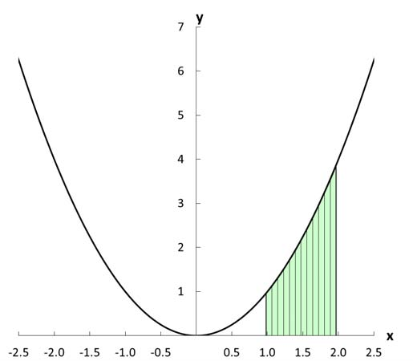

```{r setup, include=FALSE}
knitr::opts_chunk$set(echo = FALSE)
```

## Intro

The integral is the opposite of the derivative:

- The derivative helps us to figure out __the slope__ of the line.
- The integral figures out __the area__ under the line.

In terms of computation, the integral is also the opposite of the derivative:

Example: What is an integral of $2x$?

We know that the derivative of $x^2$ is $2x$, so an integral of $2x$ is $x^2$.

{ width=60% } 


## The integrals: How can they be useful for us?


1) Statistical inference: figuring out the area under the curve.

 - Understanding integrals conceptually is important for having a good understanding of inference (one of the central concepts in quantitate research).
 
- It is important to know __how__ the integrals are computed in order to better understand the results of different statistical analyses.

2) Game theory: in the expected utility theory, it helps to determine a certain uncertainty in the process.

- EU = is a way of assessing what utility you get from some process given.

$$ EU = x + \epsilon$$.

The "epsilon" $\epsilon$ is a random event.


## The definite integral (a limit of sums)

- The simplest form (most closely corresponds to the initial definition).

{ width=60% } 


## How can we approximate the area under the curve?

- By using rectangles.


{ width=60% } 

## The definite integral

In other words, the integral is the limit of the sum of the area of rectangles (as the width of each rectangle goes to zero).

If we denote the width as $\triangle x$, then the area of each rectangle is $f(x_i) \triangle x$ - the value of the function at each (evenly spaced) point.

Then, the total area is written as $\sum_if(x_i) \triangle x$.

The __definite integral__ is denoted as $\int^b_a(x)dx$.

$f(x)$ is the _integrand_ -- the function that is being integrated.

$dx$ is called an _infinitesimal_ -- it's an object that is infinitesimally small (i.e. goes to zero).

- It means that you are adding infinitesimally small rectangles together.

$a$ -- the lower bound of the integral.

$b$ -- the upper bound of the integral.

Calculating definite integrals helps us to calculate probabilities.

## Example


{ width=60% } 

## The antiderivative

$F(x)$ is the antiderivative of $f(x)$, i.e. the opposite of the derivative.

- When we differentiate the antiderivative $\frac{dF(x)}{dx}$, we get: $f(x)$ -- the two operations cancel each other out.

Let's look at an example:

__For $f(x) = 1$, what is the antiderivative of of $1$?__

Remember the power rule of differentiation: for $x^n$, the derivative is $nx^{n-1}$.

If we differentiate $x$ to $1$, we will get $1$.

So, the derivative of $f(x) = 1$ is $1$.

This means that _one possibility_ is that $F(x) = x$. Since the derivative of a constant is $0$, $$F(x)=x + C$$
The entire class of functions $x$ plus some constant $C$ are possible antiderivatives for the function of $1$.

-----

The antiderivative is the __indefinite integral__:

$$F(x) = \int(x)dx$$
Let's compare it to the definite integral:

$$\int^b_a(x)dx$$

So, the antiderivative is in many ways the inverse operation to a derivative.

## Calculating integrals

We use indefinite integrals to calculate definite integrals.

We make this connection through the __Fundamental Theorem of Calculus__:


$$\int^b_a(x)dx = F(b) - F(a)$$

- $F(a)$ - the antiderivative evaluated at point $a$.

- $F(b)$ - the antiderivative evaluated at point $b$.

This is how we can 1) connect antiderivatives to definite integrals; 2) calculate all kinds of definite integrals.

## Calculating integrals

Some basic manipulations:

- We can dissect an integral:

$\int^b_a(x)dx$ = $\int^c_a(x)dx + \int^b_c(x)dx$


- Flip $a$ and $b$:


$\int^a_b(x)dx$ = $-\int^b_a(x)dx$

- The integral of the signal point across a single point is zero:


$\int^a_a(x)dx$ = $F(a)$ - $F(a)$ = 0.

## Common functions 


{ width=60% } 


## Basic rules of integration:

{ width=60% } 


## Let's see an example:

What is $\int x^3dx$ ?

In other words, "what is the integral of $x^3$ ?"

Since, $n=3$, We can use the power rule:

$$\int x^n dx = \frac{x^{n+1}}{(n+1)} + C$$
Therefore, the result is:

$\int x^3 dx = \frac{x^4}{4} + C$.

## More rules

$\int e^x dx = e^x+C$.

$\int a^x dx = \frac {a^x} {ln(a)}+C$.

$\int ln(x) dx = xln(x)-x+C$.

$\int log_a {x} dx = \frac {xln(x)-x}{ln(a)}+C$.

## Other functions - piecewise functions

\includegraphics[width=10cm]{Function}

We could integrate this from $a \leq 2$ to $b>2$ by splitting it up: $\int_a^b f dx = \int_a^2 (-(x-2)^2) dx + \int_2^b ln(x-2) dx$.

## General properties

1) The integral is a linear operator: $\int (af(x)+bg(x))dx = a\int f(x)dx + b\int g(x)dx$.

Example:

$\int (5x^2 + e^x)dx = \frac {5x^2}{3} + e^x + C$.

2) Integration by substitution: With $x=g(u) \quad and \quad f(x) = f(g(u)), \quad \int_a^b f(g(u))g\prime(u)du = \int_{g(a)}^{g(b)} f(x)dx$.

Example:

$f(x) = \frac {-1} {2\pi}xe^{\frac {-x^2}{2}}. \quad \int (\frac {-1} {2\pi}xe^{\frac {-x^2}{2}}) dx. \quad u = g(x)=\frac {-x^2}{2}. \quad g\prime(x)=-x$. Rewrite the integral as $\int (\frac {-1} {2\pi}g\prime(x)xe^{g(x)}) dx = \int (\frac {-1} {2\pi}e^u) du = \frac {-1} {2\pi}e^u+C = \frac {-1} {2\pi}e^{\frac {-x^2}{2}}+C$.

----

3) Integration by parts: $\int f(x)g\prime(x) dx = f(x)g(x) - \int f\prime(x)g(x) dx$.

Example: $\int x^2e^x dx = x^2e^x + \int (2xe^x) dx + C$.

For the definite integral

$\int_a^b f(x)g\prime(x) dx = (f(x)g(x))(a \quad to \quad b) -  \int_a^b f\prime(x)g(x) dx$.

## Reminder - list of rules of integration

\includegraphics[width=10cm]{Rulesd}

## Practice problems:


1) What is $\int \sqrt x dx$?

2) What is $\int 9x^2 dx$?

3) What is $\int 10x + 4x^3 - 6x^2 dx$?


## 1) What is $\int \sqrt x dx$ ?


$\sqrt x$ is also $x^{0.5}$

Again, let's use the power rule:


$$\int x^n dx = \frac{x^{n+1}}{(n+1)} + C$$


And we get:

$\int \sqrt x dx$ = $\int x^{0.5} dx$ = $\frac{x^{1.5}}{1.5} + C$

## 2) What is $\int 9x^2 dx$ ?


First, we move the $9$ outside the integral:


$\int 9x^2 dx$ = 9$\int x^2 dx$

Then, we use the power rule for $x^2$:

$=9\frac{x^3}{3} + C$


Finally, we can simplify to:


$=3x^3 + C$


## 3) What is $\int 10x + 4x^3 - 6x^2 dx$ ?


First, we use the sum and difference rule:


$\int 10x + 4x^3 - 6^2 dx$ = $\int 8x + \int 4x^3 - \int 6x^2 dx$

Next, we do constant multiplication: 


$10\int x + 4\int x^3 - 6\int x^2 dx$


Apply the power rule:


$\frac{10x^2}{2} + \frac{4x^4}{4} - \frac{6x^3}{3}+C$


The result:

$=5x^2 +x^4 - 2x^3 +C$

## One more problem:


What is $\int(\frac{3x^3 +7x}{x})dx$?


## What is $\int(\frac{3x^3 +7x}{x})dx$?

First, let's simplify $\frac{3x^3 +7x}{x}$


$\frac{3x^3 +7x}{x} =  \frac{3x^3}{x} + \frac{7x}{x} = 3x^2 + 7$

Next, we can use the sum rule:

$\int(3x^2 + 7)dx = \int3x^2 + \int7dx$ 


$\int3x^2 + \int7dx = x^3 + 7  + C$ 


So, $\int(\frac{3x^3 +7x}{x})dx = \int(3x^2 + 7)dx = x^3 + 7  + C = x(x^2 + 7) + C$

The final answer: $x(x^2 + 7) + C$

Also, note that when we differentiate:

$\frac{d}{dx}(x^3) = 3x^2$


and

$\frac{d}{dx}(7x) = 7$

## Another set of exercises

1) Integrate the following derivatives to find y: $\frac {dy} {dx}= 4x^4+3x^3+2x^2+x+1$.

2) Integrate the following derivatives to find y: $\frac {dy} {dx}= (20x+2)e^{5x^2+x}$.

3) Integrate the following derivatives to find y: $\frac {dy} {dx}= x^{-1}+3x^2$.

4) Cumpute the following integrals: $\int_2^6 (3x^4+2x^3+x^2+x+1)dx$.

5) Cumpute the following integrals: $\int_2^4 (3x^4+2x^3+x^2+x+1)dx + \int_4^6 (3x^4+2x^3+x^2+x+1)dx$.

6) Cumpute the following integrals: $\int ((\frac{-1}{x})ln(\frac {1}{x}))dx$.

7) Cumpute the following integrals: $\int (xe^{3x^2+1})dx$.

8) $\int (a_nx^n + a_{n-1}x^{n-1}...+a_0)dx$. You get a bonus for expressing the integral as a sum.
