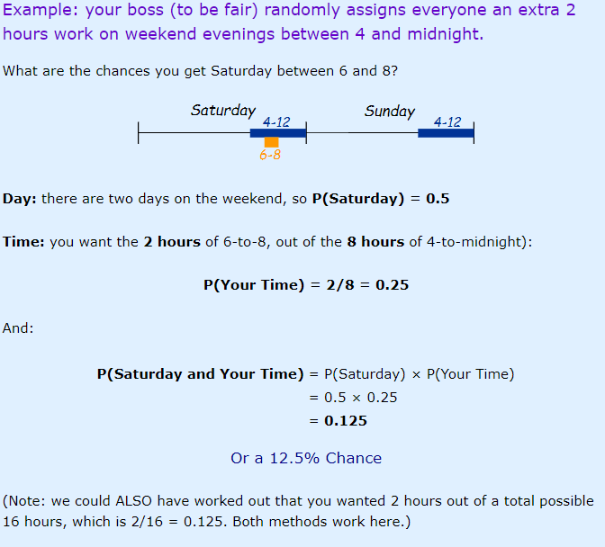
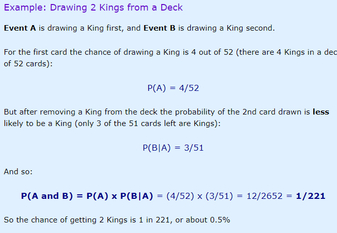
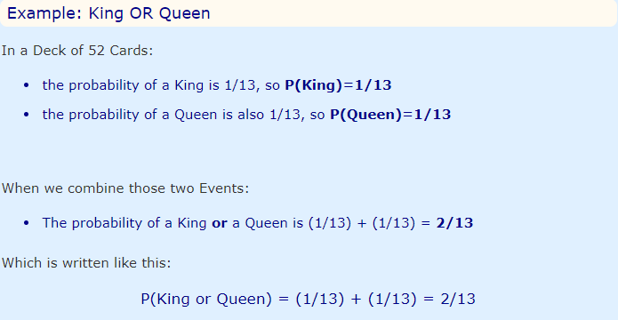
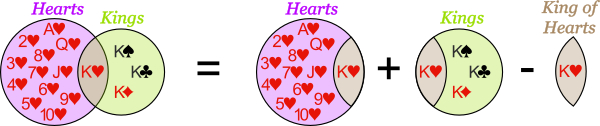
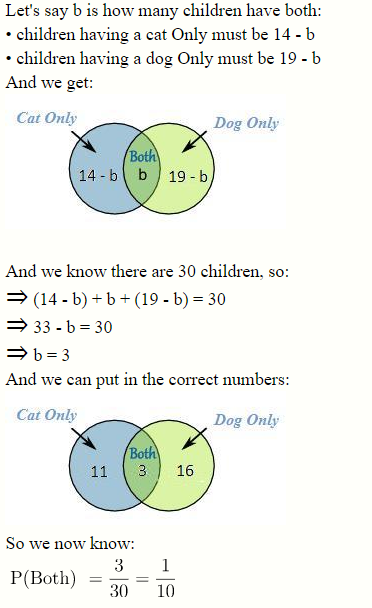
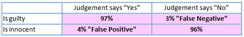
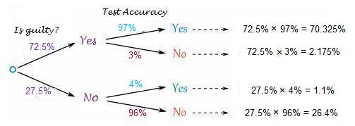
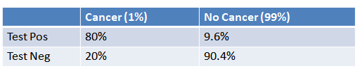

```{r setup, include=FALSE}
knitr::opts_chunk$set(echo = FALSE)
```

## Intro: Why should we care about probability?

- One of the most important concepts in statistics and game theory.
- Can be found in any dimension of social sciences.
- Understanding probabilities will help you 1) in your methods classes and 2) in understanding soc. scientific literature.
- We will look at 1) the nature of probability; 2) how to compute probabilities.

## Major presuppositions in quantitative social scientific research:

- We cannot determine behavior exactly
- We assume that there is a degree of uncertainty in how any $IV$ affects any $DV$, i.e. there is an _error_
- We include a _level of confidence_ in any interaction between an $IV$ and a $DV$
 
So, probability is central to understanding the concepts of significance and uncertainty in empirical research

- In general, social-scientific theories (and studies) are NOT deterministic but _stochastic_ (probabilistic or _random_)


## Classical probability

Core concepts:

- __Outcome__ -- something that can occur

- __Simple event__ -- composed of only one outcome

- __Compound event__ -- the result of more than one outcome

- __Sample space__ -- the set of all possible outcomes that could occur

Probability deals with issues in which the outcome is not known for certain

$Pr(e)$ = N of ways to get e / N of outcomes in the sample space


## More concepts

Empirical probability -- observed probability based on an empirical ratio

Bayesian statistics -- based on classical probability and subjective probability

- Subjective probability -- one's prior perception of probability


## Classical probability: The basics

$Pr(A)$ -- probability of an outcome occurring (from 0 to 1)

- $Pr(A) \epsilon [0,1]$

- $Pr(S) = 1$; $S$ -- sample space (to put it simply, something must happen) 


## Different types of events:

Events can be:

- __Independent__  -- each event is not affected by any other events
 
- __Dependent__  -- also called "Conditional", where an event is affected by other events

- __Mutually exclusive__ -- events can't happen at the same time


## 1) Independent events


If two events $A$ and $B$ are __independent__, their __joint__ probability equals the product of their probabilities:

$$Pr(A \cap B) = P(A)P(B)$$

-----


{ width=80% } 

## Notation:


__Joint probability__ -- two or more things happen together in some fashion

- $Pr(A \cap B)$ -- the probability in which __both__ events occur together

- $Pr(A \cup B)$ -- the probability in which __one or the other__ event occurs 


## 2) Dependent events: Conditional probability

- $Pr(A|B)$ -- the probability of $a$ conditional on $B$ --> The probability that $A$ occurs given that $B$ has already occurred 

- $P(B|A)$ means "Event B given Event A"

- Example: Winning the lottery with/without buying a ticket

- Central to Bayesian statistics

The formula is:


$$Pr(A \cap B) = Pr(B|A)Pr(A) = Pr(A|B)Pr(B)$$

- 1) The probability that $B$ happens conditional on $A$'s happening, times the chance that $A$ happens. 

- 2) The probability that $A$ happens conditional on $B$'s happening, times the chance that $B$ happens

-----


{ width=90% } 


## 3) Mutually exclusive events

When two events are mutually exclusive it is impossible for them to happen together:

- For A and B, $Pr(\text{A AND B}) = 0$

If we want to find out the probability of A __or__ B happening:

- A or B is the sum of A and B: $Pr(A \cup B) = Pr(A) + Pr(B)$


-----


{ width=100% } 


## Non-mutually exclusive events:


Example: "Kings" and "hearts" 

{ width=80% } 

The formula is: $Pr(A \cup B) = Pr(A) + Pr(B) - Pr(A \cap B)$


## Let's try to solve a few problems:

1) A card is randomly chosen from a pack of 52 playing cards.
What is the probability of a Six or a Seven?

2) There are 30 children in a class and they all have at least one cat or dog. 
14 children have a cat, 19 children have a dog. 
What is the probability that a child chosen at random from the class has both a cat and a dog?

3) In a class of 32 children, 16 have a skateboard, 12 have a bicycle and 17 have a scooter. 

- 5 of them have a skateboard and a bicycle.
- 7 of them have a skateboard and a scooter.
- 4 of them have a bicycle and a scooter.
- They all have at least one of the three things.

What is the probability that a child chosen at random from the class has a scooter but not a bicycle?


(_Source_: mathopolis)

## Six vs. Seven

Choosing a Six and a Seven are mutually exclusive events.

Therefore, use:

Use $Pr(A \cup B) = Pr(A) + Pr(B)$

There are 52 cards, so:

$\text{Pr(SIX)}=\frac{1}{13}$ and $\text{Pr(SEVEN)}=\frac{1}{13}$


$\text{Therefore, Pr(SIX or SEVEN)}=\frac{1}{13}+\frac{1}{13}=\frac{2}{13}$


## 2) Cats & dogs




## 3)  Skaterboards and bycicles

Let’s say a is the number of children who have all three things:
- children who have a skateboard and a bicycle but not a scooter must be 5 - a.
- children who have a skateboard and a scooter but not a bicycle must be 7 - a.
- children who have a bicycle and a scooter but not a skateboard must be 4 - a.

- children who have a skateboard, but not a bicycle or a scooter, must be 16 - [(5 - a) + a + (7 - a)] = 4 + a.
- children who have a bicycle, but not a skateboard or a scooter, must be 12 - [(5 - a) + a + (4 - a)] = 3 + a.
- children who have a scooter, but not a bicycle or a skateboard must be 17 - [(7-a) + a + (4-a)] = 6 + a

----

\includegraphics[width=10cm]{Skat}


----

And we know there are 32 children altogether, so:
(4 + a) + (5 - a) + a + (7 - a) + (3 + a) + (4 - a) + (6 + a) = 32
29 + a = 32
a = 3

----

\includegraphics[width=10cm]{Skat2}

----

__Result__: Pr(A child has a scooter but no bicycle) = $\frac {13} {32}$.


## Combinations and permutations

__A combination__ is a way of choosing k objects from n objects when one does not care about the order in which one chooses the objects.

$C_n^k = \frac {n!} {k! (n-k)!}$.

__A permutation__ is a way of choosing k objects from n objects when one does care about the order in which one chooses the objects.

$P_n^k = \frac {n!} {(n-k)!}$.

## Bayes' Rule

The bedrock of multiple types of quantitative analysis

Takes a prior belief about some event's occurrence and transforms into a posterior belief about that event

- Prior belief --> New data --> posterior belief
- $P(A)$ --> $P(A/B)$ 

Used in statistics and game theory:

- In statistics, it forms the basis of what's known as Bayesian statistics

- Prior distribution --> new data --> posterior distribution

- In Signaling theory: How the receiver goes from prior to posterior belief based on the signaler's actions/ new information

The Bayes' rule can be very helpful in medicine (diagnostics) -- how to properly update prior beliefs based on new information

## How does it work?

Recall that:

$$Pr(A \cap B) = Pr(B|A)Pr(A) = Pr(A|B)Pr(B)$$
So, the Bayes' rule (or theorem) states:


$$Pr(A|B) = Pr\frac{Pr(B|A)Pr(A)}{Pr(B)}$$
The probability of some event $A$ conditional on some event $B$ is equal to the probability of $B$ given $A$ devided by the probability of $B$,

- P(A|B) is "Probability of A given B", the probability of A given that B happens.

- P(A) is Probability of A.

- P(B|A) is "Probability of B given A", the probability of B given that A happens.

- P(B) is Probability of B.


## Example:


If some infectious disease is rare (1%) but high fever is fairly common (10%), and the 90% of cases involving this disease exhibit high fever, then:


$Pr(\text{Disease|High fever}) = \frac{Pr(\text{Disease}) Pr(\text{(High fever|Disease)}}{Pr\text{(High Fever)}} = \frac {1X90}{10}	 = 9$


__Result__: In this case, 9% of the time expect high fever to mean an infectious disease.


## False positives and false negatives:


One of the most common situations when we can use the Bayes' rule

- However, the formula needs to be updated

__Example__ (_Source_: mathopolis.com): 

At the Fairtown High Court, people on trial are judged as follows:

- For people who really are guilty, the judgement says "Yes" 97% of the time 
- For people who are in fact innocent, the judgement says "Yes" 4% of the time ("false positive") 

If 72.5% of people on trial really are guilty, and the judgement for a randomly selected person says "Guilty", what are the chances that the person really is guilty?

## How to solve it:

This puzzle can be represented as a table:


And as a tree diagram:



## The formula

For false positives/negatives, we use an updated formula:

$$Pr(B|A) = \frac {Pr(A|B)Pr(B)}{P(A|B)Pr(B) + Pr(A|\text{NOT B})Pr(\text{NOT B})}$$

It reads as follows: "the posterior probability of B given A is the product of the prior probability of B and the probability of A given B divided by the product of the prior probability of B and the probability of A given B plus the product of the prior probability of not B and the probability of A given not B."


##Our example:

- Pr(B|A) = $x$ -- Chance of being "really guilty" 
- Pr(A|B) = 97% -- Chance of being guilty when the judgement says "Yes" (True positive)
- Pr(B) = 72.5% -- Chance of being guilty
- Pr(A NOT B) = 4% -- Chance of recieving a "Yes" judgment while being innocent (False positive)
- Pr (Not B) = 27.5% -- Chance of recieving a "No" judgement


$$Pr(B|A) = \frac {Pr(A|B)Pr(B)}{P(A|B)Pr(B) + Pr(A|\text{NOT B})Pr(\text{NOT B})}$$

So:

$$x = \frac {0.97 * 0.725}{0.97*72.5 + 0.04 *0.275} = \frac {0.70325}{0.70325 + 0.011} = \frac {0.70325}{0.71425} = 0.9845$$

__Result__: In 98.46% of cases, those who receive the "Yes" judgement are really guilty.


## Let's practice:

- 1% of women have breast cancer.
- 80% of mammograms detect breast cancer when it is there.
- 9.6% of mammograms detect breast cancer when it's __not__ there.

__How likely is it to have cancer with a positive result?__


## Solution:



-----

The formula is:

$$Pr(A|B) = \frac {Pr(B|A)Pr(A)}{P(B|A)Pr(A) + Pr(B|\text{NOT A})Pr(\text{NOT A})}$$

- Pr(A|B) = Chance of having cancer (A) given a positive test (B). This is what we want to know: How likely is it to have cancer with a positive
result? This is our $x$.
- Pr(B|A) = Chance of a positive test (B) given that one had cancer (A). This is the chance of a true positive, 80% in our case.
- Pr(A) = Chance of having cancer (1%).
- Pr(not A) = Chance of not having cancer (99%).
- Pr(B|not A) = Chance of a positive test (B) given that one didn't have cancer (~A). This is a false positive, 9.6% in our case.

-----


Plug in the numbers:


$$x = \frac {0.8 * 0.01}{0.8*0.01 + 0.096 *0.99} = \frac {0.008}{0.008 + 0.09504} = 0.0776$$

__Result:__ The chance of cancer with a positive result is 7.76%

## Odds and odds ratios

__The odds of an event__ is defined as the ratio of the probability of the event's occurring and the probability that it does not occur: $\frac {Pr(y)} {Pr(\neg y)}$.

__The odds ratio of two events__, $x_1$ and $x_2$, then, is the ratio of the individual odds: 
$\frac {(\frac {Pr(x_1)}{Pr(\neg x_1)})} {(\frac {Pr(x_2)}{Pr(\neg x_2)})}$.

## More exercises

1) Characterize the following as independent, mutually exclusive, and/or collectively exhaustive:

a) 33 year-old, middle income, Asian American, male.

b) Vote share, size of the economy, education level.

c) Less, same, more.

----


a) 33 year-old, middle income, Asian American, male.

Independent (well, largely: gender, race, and age are associated with income level, but the other three are independent).

b) Vote share, size of the economy, education level.

Independent (again, largely: an incumbent political party's vote share is associated with macroeconomic activity).

c) Less, same, more.

Mutually exclusive and collectively exhaustive values of a variable.

----

Let $P(A) = 0.3$ and $P(A \cup B) = 0.5$. Find P(B), assuming both events are independent.

----

In general, $P(A \cup B) = P(A) + P(B) - P(A \cap B)$ and $P(A \cap B)=P(A|B)P(B)$, which, when combined, yield: 
$P(A \cup B) = P(A) + P(B) - P(A|B)P(B)$. If the two events are independent, then P(A|B) = P(A), giving $P(A \cup B) = P(A) + P(B) - P(A)P(B) = P(B)(1 - P(A)) + P(A)$.

We solve for P(B) to get $P(B)=\frac {P(A \cup B) - P(A)}{1 - P(A)} =\frac {0.5-0.3}{1-0.3}=\frac{2}{7}$.

----

Let P(A) = 0.4 and $P(A \cup B) = 0.6$. Find P(B), assuming both events are independent.

----

$P(B) = \frac {0.6-0.4}{1 - 0.4} = \frac {1} {3}$.

----

Compute each of the following:

1) $\frac {5!}{6!}$.

2) $C_{12}^5$.

3) $P_{7}^2$.

----

A committee contains fifteen legislators with ten men and five women. Find the number of ways that a delegation of six:
a) Can be chosen.
b) With an equal number of men and women can be chosen.
c) With a proportional number of men and women can be chosen.

---- 

(a) This is the number of ways 6 elements can be chosen from 15, or $C_{15}^6$.

(b) Now we have the joint probability of two independent events: choosing 3 women from 5 and 3 men from 10. This is: $C_{5}^3 \times C_{10}^3$.

(c) Finally, we have the joint probability of two independent events: choosing 2 women from 5 and 4 men from 10, since there are twice as many men as women in the full group. This is: $C_{10}^4 \times C_{5}^2$.

----

In a certain city, 30\% of the citizens are conservatives, 30\% are liberals, and 40\% are independents. In a recent election, 50\% of conservatives voted, 40\% of liberals voted, and 30\% of independents voted.

a) What is the probability that a person voted?
b) If the person voted, what is the probability that the voter is conservative?

----

(a) Pr(V ) = Pr(V|C)Pr(C) + Pr(V|L)Pr(L) + Pr(V|I)Pr(I) = 0.39.
b) Pr(C|V) = (Pr(V|C)Pr(C))/Pr(V) = $\frac {0.5 \cdot 0.3} {.39} = 0.38$.

----

If the odds of $x_1$ are 3:1 and the odds of $x_2$ are 1:2, what is the odds ratio of $x_1 : x_2$?

----

$\frac {3/1}{1/2}= \frac {3}{0.5}=6$.
