```{r setup, include=FALSE}
knitr::opts_chunk$set(echo = TRUE)
```

## Intro

Broad topic:

- Deals with general linear equations and systems of linear equations
- In social sciences, we often have to manipulate the representations of these equations in the form of vectors and matrices

In stats: variables and data.

----

## Notation - Matrices and regressions

We can represent a $DV$: $\begin{pmatrix}
  y_{1} \\
  y_{2} \\
  \vdots    \\
  y_{n}  
 \end{pmatrix}$


And several $IV$: $\begin{pmatrix}
  a_{1,1} & a_{1,2} & \cdots & a_{1,n} \\
  a_{2,1} & a_{2,2} & \cdots & a_{2,n} \\
  \vdots  & \vdots  & \ddots & \vdots  \\
  a_{m,1} & a_{m,2} & \cdots & a_{m,n} 
 \end{pmatrix}$
 
 - We can represent data through vectors and matrices and then use them to compute coefficients of linear regressions.
 
Keep an eye on notation -- It can be tricky.

- In academic books, scalars are written as small $x$; vectors are typically bolded -- __x__; matrices are written as $X$.
 
- Oftentimes, vectors are written as $\vec{x}$.

----

## Scalars

Definition: A scalar is any single component or single element.

- Typically, we assume that a scalar is just a real number:

$x_1 \in \mathbf{R}$.

----

## Vectors

Definition: A vector is a collection of scalars that has certain properties.

Two types:

1) Row: $(x_1.....x_2.....x_3.....x_n)$.

2) column: $\begin{pmatrix}
  y_{1} \\
  y_{2} \\
  \vdots    \\
  y_{n}  
 \end{pmatrix}$
 
- The dimension of the vector is the $N$ of components in that vector.

----
 
## Graphical representation:
 
 
 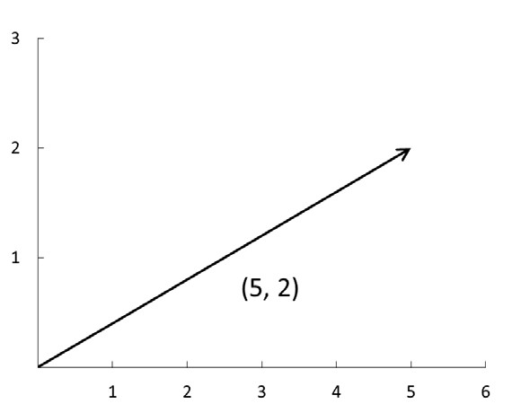{ width=80% } 
 
---- 
 
## How to manipulate vectors:

__Vector addition__:

$\vec{a} + \vec{b}$ = $\begin{pmatrix}
  5+1  \\
  2+1 \\
 \end{pmatrix}$ = $\begin{pmatrix}
  6 \\
  3 \\
 \end{pmatrix}$


If $\vec{a}$ = $\begin{pmatrix}
  1 \\
  2 \\
 \end{pmatrix}$  and $\vec{b}$ = $\begin{pmatrix}
  2 \\
  1 \\
 \end{pmatrix}$ 
 
- We must have the same N of dimensional elements in both vectors (in this case, 2 and 2). 

----
 
## Vector addition:

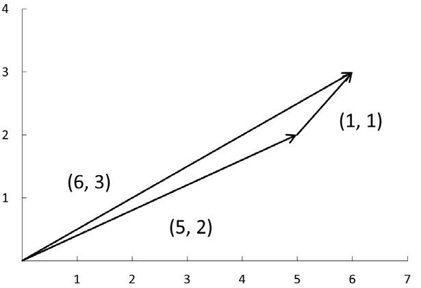{ width=80% } 

----
 
## Scalar multiplication:

We can multiply scalars by vectors:


$c * \vec{a}$ = $5 *$ $\begin{pmatrix}
  2  \\
  1 \\
 \end{pmatrix}$ = $\begin{pmatrix}
  5*2 \\
  5*1\\
 \end{pmatrix}$ = $\begin{pmatrix}
  10 \\
  5\\
 \end{pmatrix}$


If $\vec{c} = 5$ and $\vec{a}$ = $\begin{pmatrix}
  2 \\
  1 \\
 \end{pmatrix}$ 

----

## Example:

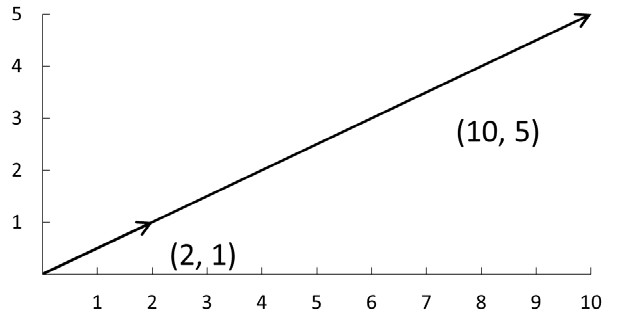{ width=80% } 
 
----

## Vector multiplication:

The __scalar product__ is a way of multiplying vectors that results in a scalar.

- Also known as __dot product__: $\vec{a} \cdot\vec{b}$.

If $a$ and $b$ are both n-dimensional vectors, then:
$\vec{a} \cdot\vec{b} = a_1b_1 + a_2b_2 +....+a_nb_n$.

In other words, $\vec{a} \cdot\vec{b} = \sum^n_{i=1}a_ib_i$.

An example: $(3; 1) \cdot (2; 3) = 6 + 3 = 9$.

- The two vectors must have equal dimensions.

The dot product helps us to understand independence (perpendicularity) and collinearity.

----

## How can vectors be useful?

Data are stored in vectors. 

- Each variable has an associated vector, and each component of this vector is an observation or data point.
- Parameters are also stored in vectors.

Example: logistic regression returns a vector of coefficients  --> The effect of each of the IVs on the DV.

----

## Examples (_Source_: mathsisfun.com)

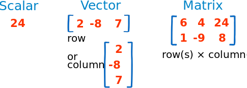{ width=80% } 

----

## Matrices - introductory notions

A __matrix__ is a way to represent a set of numbers. For example, the following set of numbers can be represented in matrix terms: $2,3,7,-7, 0,4,5,-2,11,12,-6,5$.

\begin{center}
$\begin{pmatrix}
  2 \\
  3 \\
  7 \\
  -7 \\
  0 \\
  4 \\
  5 \\
  -2 \\
  11 \\
  12 \\
  -6 \\
  5 \\
\end{pmatrix}$
\end{center}
 
----

or as $\begin{pmatrix}
  2 & 3 & 7 \\
  -7 & 0 & 4 \\
  5 & -2 & 11 \\
  12 & -6 & 5 \\
\end{pmatrix}$

or as 
$\begin{pmatrix}
2 & 3 & 7 & -7 & 0 & 4 & 5 & -2 & 11 & 12 \\
\end{pmatrix}$

A matrix is a way to write a group of scalars in an ordered fashion. A __matrix__ is shaped like a rectangle and has a certain numbers of __rows__ and a certain number of __columns__. The number of rows and columns of a matrix constitute the __dimensions__ (sometimes called __order__) of the matrix. The dimensions of a matrix are denoted as $r \times c$, read "r by c". The first number ("r here") is the number of rows and the second number ("c" here) is the number of columns in the matrix. So, the first matrix is a $12 \times 1$ matrix, the second one is $4 \times 3$, and the last one is $1 \times 10$. 

A __$1 \times 1$__ ("one by one") matrix is a special case. We think of a $1 \times 1$ matrix as a simple scalar - just a number. [3] is simply 3, for example.

----

We could write a $p \times q$ matrix B, with elements b (notice there are p times q = pq elements) as

__B__ = $\begin{pmatrix}
  b_11 & b_12 & b_13 & ... & b_1q\\
  b_21 & b_22 & b_23 & ... & b_2q\\
  b_31 & b_32 & b_33 & ... & b_3q\\
  ... & ... & ... & ... & ...\\
  b_p1 & b_p2 & b_p3 & ... & b_pq\\
  \end{pmatrix}$
  
where, for example, $b_pq$ is the element in the $p^{th}$ row, $q^{th}$ column of the matrix. 
  
---- 

Two matrices are __equal__ if they are of the same dimensions and each corresponding element is the same number. Mathematically, we say __P=Q__ if and only if __P__ and __Q__ have the same dimensions ($r \times c$) and $p_{ij} = q_{ij}$ for all i=1,2,3...,r and for all j=1,2,3,...,c.

A __row matrix__ is a matrix with exactly one row. Sometimes a row matrix is called a __row vector__. 

A __column matrix__ is a matrix exactly one column. Sometimes a column matrix is called a __column vector__.

A __zero matrix__ is simply a matrix with all elements equal to zero. A zero matrix can be of any dimension. Often a zero matrix will be noted by a bold-faced zero. An example:

__0__ = $\begin{pmatrix}
  0 & 0 & 0 \\
  0 & 0 & 0 \\
  0 & 0 & 0 \\
 \end{pmatrix}$
 
---- 

The __transpose of a matrix__ is the original matrix with the columns abd rows interchanged. We write the transpose of matrix __J__ as either __$J\prime$__ (pronounced "J prime") or $J^T$ ("J transpose").

$$
J = \left [\begin{array}{ccc} 
2 & 3 & 7 \\
-7 & 0 & 4 \\
5 & -2 & 11 
\end{array}\right]
J^T = \left[\begin{array}{ccc} 
2 & -7 & 5 \\
3 & 0 & -2 \\
7 & 4 & 11
\end{array}\right]
$$ 

----

A __square matrix__ is a matrix with the same number of rows and columns. An example (3 by 3 matrix):

$$B = \left [\begin{array}{ccc} 
2 & 3 & 7 \\
-7 & 0 & 4 \\
5 & -2 & 11 
\end{array}\right]$$

The __diagonal of a square matrix__ is a set of numbers consisting of the elements on the line from the upper-left-hand to the lower-right-hand corner of the matrix. Only a square matrix has a diagonal. 
Diagonal of B = diag(__B__) = ${2, 0, 11}$.

----

The __trace of a matrix__ is simply the sum of the diagonal elements of the matrix. So, then, a matrix must be a square matrix in order for it to have a Trace. 
Trace of B = trace(__B__) = tr(__B__) = $2+0+11 = 13$.

A __symmetric matrix__ is a square matrix that is equal to its transpose. In other words, a $p \times p$ matrix is symmetric if and only if $m_{jk} = m_{kj}$ for all k between 1 and p (where $1 \leq j \leq p$ and $1 \leq k \leq p$). 

$$C = C^T = \left [\begin{array}{ccc} 
3 & 1 & -4 \\
1 & 9 & 0 \\
-4 & 0 & 7 
\end{array}\right]$$

----

An __upper triangular matrix__ is a square matrix with all the elements below the diagonal equal to zero (matrix A). A __lower triangular matrix__ is a square matrix with all the elements above the diagonal equal to zero (matrix B).

$$A = \left [\begin{array}{ccc} 
2 & 3 & 7 \\
0 & 5 & 4 \\
0 & 0 & 11 
\end{array}\right]
B = \left[\begin{array}{ccc} 
2 & 0 & 0 \\
3 & 4 & 0 \\
7 & 4 & 9
\end{array}\right]
$$ 

A __diagonal matrix__ is a square matrix that is both upper and lower triangular, that is, all the elements that are not on the diagonal are equal to zero (Matrix D).

$$D = \left [\begin{array}{ccc} 
3 & 0 & 0 \\
0 & 9 & 0 \\
0 & 0 & 7 
\end{array}\right]$$

----

The __scalar matrix__ is a diagonal matrix with the diagonal elements all equal to each other (M matrix). The __identity matrix__ is a scalar matrix with all of the diagonal elements equal to one. We will reserve the capital letter I for the identity matrix (see below).

$$M = \left [\begin{array}{ccc} 
2 & 0 & 0 \\
0 & 2 & 0 \\
0 & 0 & 2 
\end{array}\right]
I = \left[\begin{array}{ccc} 
1 & 0 & 0 \\
0 & 1 & 0 \\
0 & 0 & 1
\end{array}\right]
$$ 

A __partitioned matrix__ (__block matrix__) is a matrix made up of other matrices.

----

## Matrix addition


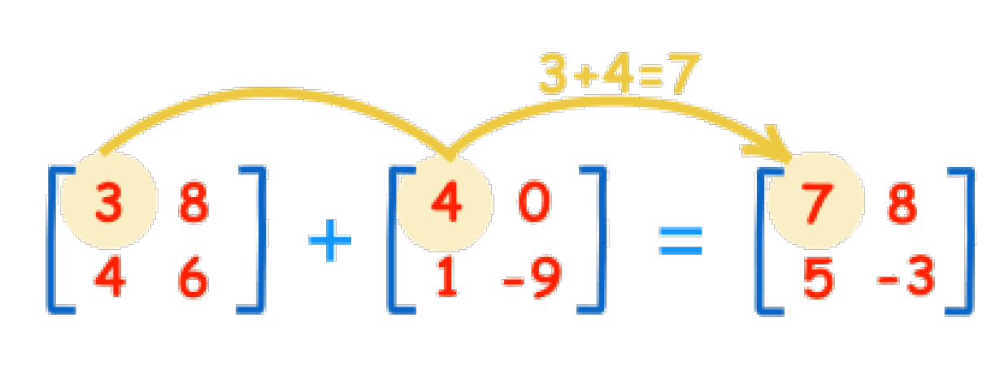{ width=80% } 

----

## Matrix subtraction

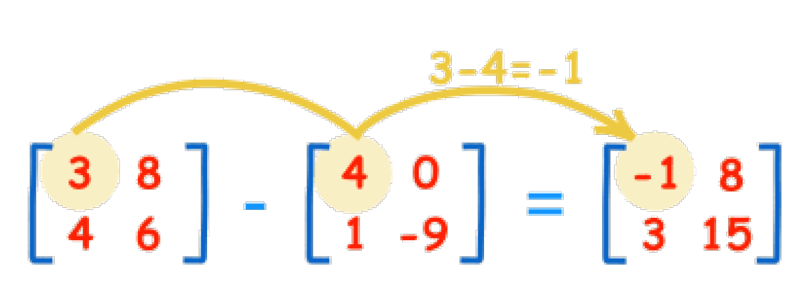{ width=80% } 


----

## Multiplication by a constant

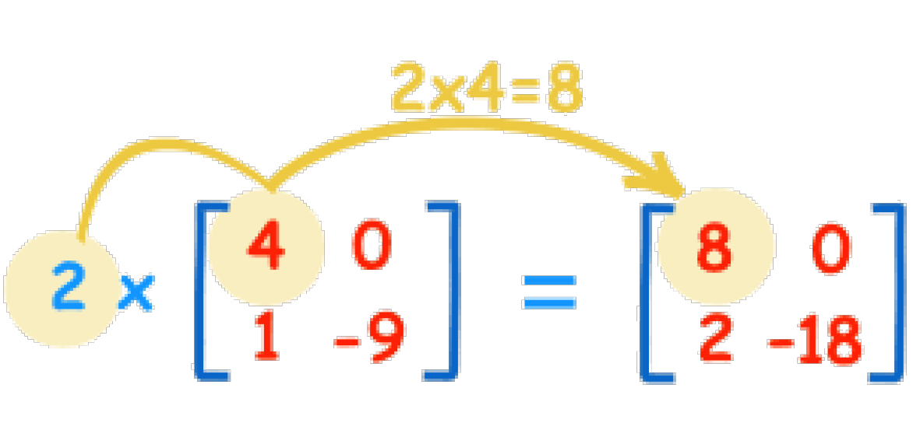{ width=80% } 

----

## Matrix multiplication

We use the dot product by multiplying matching members:

Example (_Source_ mathisfun.com): 

What is $A \cdot B$? If $A=$ $\begin{pmatrix}
  1 & 2 & 3 \\
  4 & 5 & 6 \\
 \end{pmatrix}$ and $B=$ $\begin{pmatrix}
  7 & 8  \\
  9 & 10  \\
  11 & 12  \\
 \end{pmatrix}$
 
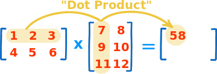{ width=50% } 

$(1, 2, 3) \cdot (7, 9, 11) = 1X7 + 2X9 + 3X11 = 58$

----

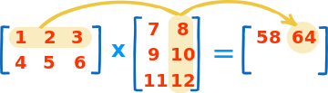{ width=50% } 

$(1, 2, 3) \cdot (8, 10, 12) = 1X8 + 2X10 + 3X12 = 64$

We do it for the rest of rows and columns and we get:

$(4, 5, 6) \cdot (7, 9, 11) = 4X7 + 5X9 + 6X11 = 139$

$(4, 5, 6) \cdot (8, 10, 12) = 4X8 + 5X10 + 6X12 = 154$


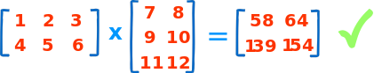{ width=60% } 

----

## Let's look at a practical example:

Thomson House sells beef pies ($3), chicken pies ($4), and vegetable pies ($2).

This is how many pies they sold from Monday to Thursday:

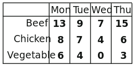{ width=50% } 

How much money did they make each day?

----

## Answer:

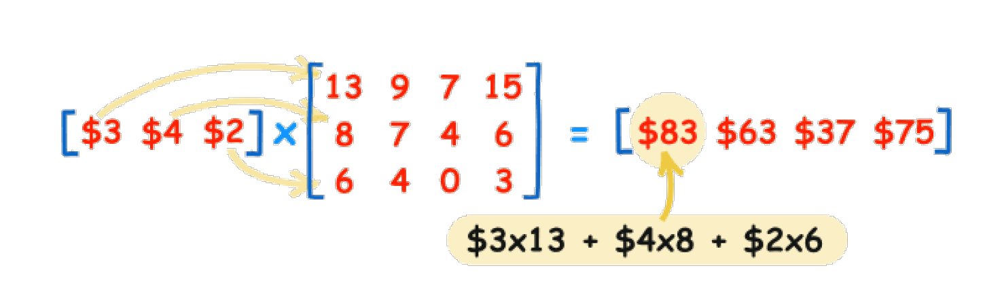{ width=90% } 

----

## Matrix properties (1)

$k, k_1, k_2$ - Scalar (Number)
__A, B, C__ - Matrix
__I__ - Identity Matrix
__0__ - Zero Matrix
__D__ - Diagonal Matrix (Diagonal elements = $d_{ii}$)

__Addition and scalar multiplication__:
$A + B = B + A$.
$(A + B) + C = A + (B + C)$.
$(k_1 + k_2)A = k_1A + k_2A$.
$k(A+B)= kA + kB$.
$kA = Ak$.
$0A = 0$.
$k_1(k_2A)=(k_1k_2)A$.
$kAB = (Ak)B= a(kB)=ABk$.

__Matrix multiplication__:
The conformability condition.
In general, $AB \neq BA$.
$(AB)C = A(BC)$.
$(A+B)C = AC + BC$.
$A(B+C)=AB + AC$.
$IA=AI=A$.
$0A=A0=0$.
AB $\rightarrow$ pre-multipliying by A, post-multiplying by B, A $\rightarrow$ Lead, B $\rightarrow$ Lag.

----

## Let's practice:


\includegraphics{pr1}


\includegraphics{pr2}


\includegraphics{pr3}


----

## 1.

\includegraphics{pr1}

Let's work it out:

\includegraphics{sol1}


----

## 2.

\includegraphics{pr2}


\includegraphics{sol2}

----

## 3.

\includegraphics{pr3}


This is where it gets tedious:

\includegraphics{sol3}

----

## Another exercise

Suppose a company manufactures two kinds of furniture: chairs and sofas. Each chair requires 12 feet of wood, 2 bolts of cloth, anf 5 pounds of feathers. Each sofa requires 30 feet of wood, 7 bolts of cloth, and 20 pounds of feathers. Suppose we must choose one, and only one, of two potential suppliers for the materials we will need. 

Supplier 1 charges \$8 per foot for wood, \$11 per bolt for cloth, and \$6 per pound of feathers. Supplier 2 charges \$4 per foot for wood, \$23 per bolt for cloth, and \$5 per pound for feathers. With the goal of minimizing the total cost charged by the supplier this month, which supplier should the company use, given that 45 chairs and 30 sofas will be produced this month? Note that the total cost charged by each supplier is equal to the following multiplicative product: how much the supplier charges for each material times how much material is required for each product times how much of each product is being produced.

----

## Solution

To represent how much each supplier charges for each material, let S = $$\left[\begin{array}{ccc} 
8 & 11 & 6 \\
4 & 23 & 5 
\end{array}\right]$$.

To represent how much material is required for each product, let  R = $$\left[\begin{array}{cc} 
12 & 30 \\
2 & 7 \\
5 & 20
\end{array}\right]$$.

To represent how much of each product is being produced, let  P = $$\left[\begin{array}{c} 
45 \\
30
\end{array}\right]$$.

----

The total cost charged by each supplier can be calculated by multiplying these three matrices. 

C = SRP = $$\left[\begin{array}{c} 
19,770 \\
16,785 
\end{array}\right]$$.

So, this month the company should use Supplier 2. The total cost will be \$16,785.

----

# Determinants and condition numbers

The __determinant of a matrix__ is a number that describes some characteristics of a matrix - det(a) or |A|.

Every square matrix has a determinant - and only a square matrix has a determinant. We sometimes pre-multiply of post-multiply a non-square matrix by its transpose and then calculate the determinant of the resulting square matrix.

Quite often the determinant is used to consider the nature of the (non)singularity of a matrix.
- $det(A) \neq 0$ - we have no perfect linear combination of columns or of rows $\rightarrow$ A is nonsingular ($A^{-1}$ does exist).
- $det(A) = 0$ - we have at least one perfect linear combination of columns and of rows $\rightarrow$ A is singular $A^{-1}$ does not exist).

----

- $det(A)$ is "close" to 0 - we come close to having at least one perfect linear combination of columns and of rows. A is technically non-singular ($A^{-1}$ does exist), but it is almost singular. The matrix is badly scaled and ill-conditioned. The inverse is unstable: a tiny change in one of the elements of the original matrix can result in huge changes in some or all of the elements of its inverse. It might even cause the inverse to not exist.

----

Sometimes __the condition number__ of a matrix (cond(a) or $\kappa(A)$) is reported by the statistical software in the regression diagnostic. The condition number describes the properties related to a matrix's determinant value and to its inverse.

If the condition number is small (close to one), the matrix is well-conditioned. Its determinant values its large, the inverse of the matrix is stable.
Large (much bigger than one), then the matrix is ill-conditioned. Its determinant value is small. The inverse of the matrix is unstable.
Infinite, then the matrix is singular. Its determinant value is zero. The inverse of the matrix does not exist.

----

## Calculating the determinant of a matrix

A = $$\left[\begin{array}{cc} 
a_{11} & a_{12} \\
a_{21} &  a_{22}
\end{array}\right]$$.

$det(A) = a_{11} \cdot a_{22} - a_{21} \cdot a_{12}$. 

C = $$\left[\begin{array}{cc} 
3 & 10 \\
4 &  6
\end{array}\right]$$.

$det(C) = 3 \cdot 6 - 4 \cdot 10 = 18-40= (-22)$. 


----

__The minor of an element__ is the determinant of the submatrix of that element. __The cofactor of a minor__ is the signed minor of an element such that its sign is the same as the minor when the row and column numbers of the element have an even sum, and its sign is the opposite of the minor when the row and column numbers of the element have an odd sum.

The determinant of an $n \times n$ matrix, where $n > 2$, is the sum of the products of each element and its cofactor for any row or column. Example:

C = $$\left[\begin{array}{ccc} 
1 & 4 & 3 \\
1 & 2 & 0 \\
2 & 3 & 1
\end{array}\right]$$.

----

We will work with column 2.

$det(C) = 4C_{12} + 2C_{22} + 3C_{32}$.

$M_{12}$ = $$\left[\begin{array}{cc} 
1 & 0 \\
2 & 1
\end{array}\right]$$.

$M_{12} = 1 \cdot 1 - 2 \cdot 0 = 1$.

Similarly, $M_{22}=-5 \quad and \quad M_{32}=-3$. Given the sign of the cofactors, the determinant of C will be calculated in the following way: $det(C) = 4 \cdot (-1) + 2\cdot(-5) + 3 \cdot (3) = -5$. 

----

## The inverse of a matrix

A square matrix that is not invertible is called singular; it has a determinant of zero. An invertible square matrix is called nonsingular, and its determinant is non-zero.

An $n \times n$ matrix, A, is invertible (only square matrices can be inverted) if one can find a second $n \times n$ matrix, B, such that the product AB and the product BA both produce the $n \times n$ identity matrix, $I_{n \times n}$. In such a situation, B is the inverse of A.

$A^{-1} = (\frac {1}{det(A)}) \times C^T$. ($C^T$ is the transpose of the matrix of cofactors of A). 

A = $$\left[\begin{array}{ccc} 
1 & 2 & 1 \\
0 & 4 & 3 \\
-6 & -2 & 2
\end{array}\right]$$.

----

$det(A) = 1 \cdot M_{11} - 2 \cdot M_{12} + 1 \cdot M_{13} = 1(14) -2(18)+1(24)=2$.

$M_{11}=14, M_{12}=18, M_{13}=24,..., M_{33}=4$.

$$C = \left [\begin{array}{ccc} 
14 & -18 & 24 \\
-6 & 8 & -10 \\
2 & -3 & 4 
\end{array}\right]
C^T = \left[\begin{array}{ccc} 
14 & -6 & 2 \\
-18 & 8 & 3 \\
24 & -10 & 4
\end{array}\right]
$$ 

----

$A^{-1}= (\frac {1}{det(A)}) \times C^T = \frac{1}{2} \times C^T$.

$$A^{-1} = \left[\begin{array}{ccc} 
7 & -3 & 1 \\
-9 & 4 & \frac{-3}{2} \\
12 & -15 & 2
\end{array}\right]$$.

----

## Matrix properties (2)

__Transpose__:
$(A\prime){\prime}=A$.
$(AB)\prime =B\prime A\prime$.
$(ABC)\prime = C\prime B\prime A\prime$.
$(A^{-1})\prime = (A\prime)^{-1}$.
$AA\prime \quad and \quad A\prime A \rightarrow$ each is square and symmetric.
$I\prime = I$.
$det(A\prime) = det(A)$.
$rank(A\prime) = rank(A)$.
$(kA)\prime = k(A)\prime$.
$(A+B)\prime = A\prime + B\prime$.
If $A\prime A=0$, then $A = 0$.

__Determinant__:
$det(AB)=[det(A)][det(B)]$.
$det(A) = det(A\prime)$.
$det(A^{-1})=\frac {1}{det(A)}$.
$det(kA)=k^ndet(A)$. (A is a $n \times n$ matrix).

__Inversion__:
$(A^{-1})^{-1}=A$.
$(AB)^{-1}=B^{-1}A^{-1}$.
$(ABC)^{-1}=C^{-1}B^{-1}A^{-1}$.
$(A\prime)^{-1}=(A^{-1})\prime$.
$AA^{-1}=A^{-1}A=I$.
$I^{-1}=I$.
$det(A^{-1})=\frac {1}{det(A)}$.
$rank(A\prime) = rank(A)$.
$(kA)^{-1}=(\frac{1}{k})A^{-1}$.
$A^{-k}=(A^k)^{-1}$.
$D^{-1} \rightarrow$ also a diagonal matrix. Diagonal elements = $\frac {1}{d_{ii}}$.

----

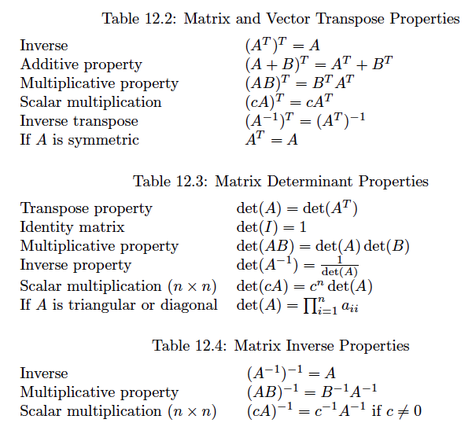


----

## Exercises: 

1) Suppose that

$$A = \left[\begin{array}{c} 
2 \\
3 \\
1
\end{array}\right]$$.

$$B = \left[\begin{array}{ccc} 
2 & 1 & 3 \\
0 & 4 & 1
\end{array}\right]$$.

$$C = \left[\begin{array}{cc} 
-2 & 7 \\
6 & 0 \\
-1 & 5
\end{array}\right]$$.

----

a) Find the product matrix for each of the following matrices that are conformable for multiplication: AB, BA, AC, CA, BC, CB.
b) Should we be surprised that BC and CB ae not equal to each other? Briefly explain why.

----

## Solution

AB - not conformable for multiplication.
$$BA = \left[\begin{array}{c} 
10 \\
13
\end{array}\right]$$.

AC - not conformable for multiplication.
CA - not conformable for multiplication.

$$BC = \left[\begin{array}{cc} 
-1 & 29 \\
23 & 5
\end{array}\right]$$.

----

$$CB = \left[\begin{array}{ccc} 
-4 & 26 & 1 \\
12 & 6 & 18 \\
-2 & 19 & 2
\end{array}\right]$$.

b) We should not be surprised that $BC \neq CB$. BC is a $2 \times 2$ matrix while CB is a $3 \times 3$ matrix. Also, matrix multiplication is not commutative (the order matters).

----

2.
a) Find the trace of the matrix: $$D = \left[\begin{array}{ccc} 
3 & 5 & 8 \\
2 & -4 & 1 \\
-1 & 2 & 9
\end{array}\right]$$.

b) What is the only type of matrix that has a trace? Why?

----

The trace is the sum of the diagonal elements of a matrix. So the trace is: 3 + (-4) + 9 = 8.

Only a square matrix has a diagonal, so that is the only type of matrix that can have a trace.

----

3. A symmetric matrix is a square matrix that is equal to its .............. Explain why.

4. If a matrix has dimensions $4 \times 9$, then its transpose will have dimensions ...........

5. Complete the following matrix so that it is symmetric.

$$E = \left[\begin{array}{ccc} 
3 & .. & .. \\
4 & 2 & 8 \\
5 & .. & 1
\end{array}\right]$$.

----

3. Transpose. Interchanging the rows and the columns does not matter in a symmetric matrix, since the element in the $i^{th}$ row, $j^{th}$ column is the same as the element in the $j^{th}$ row, $i^{th}$ column.

4. $9 \times 4$. Since rows and column interchange roles when you take the transpose.

5. $$E = \left[\begin{array}{ccc} 
3 & 4 & 5 \\
4 & 2 & 8 \\
5 & 8 & 1
\end{array}\right]$$ symmetry.

----

6. Recall that $I_p$ is the notation for a $p \times p$ identity matrix. Let $$F = \left[\begin{array}{cc} 
3 & 6 \\
2 & 8 \\
-4 & 1
\end{array}\right]$$.

a) Find the value for p so that $I_pF=F$. 
b) Find the value for p so that $FI_p=F$.

----

a) p = 3
b) p = 2

----

7. a) Find $AA\prime$ and also find $A^T$ if $$A = \left[\begin{array}{ccc} 
4 & 0 & 2 \\
3 & 1 & 5
\end{array}\right]$$. symmetry.

b) Is it a coincidence that both $AA\prime$ and $A^TA$ are a square and symmetric matrix?

----

a.
$$AA\prime = \left[\begin{array}{cc} 
20 & 22 \\
22 & 35  
\end{array}\right]$$.

$$A^TA = \left[\begin{array}{ccc} 
25 & 3 & 23 \\
3 & 1 & 5 \\
23 & 5 & 29
\end{array}\right]$$

b. Not a coincidence. Anytime you pre-multiply or post-multiply a matrix by its transpose the result always will be a square, and also a symmetric matrix.

----

8. Calculate the determinant of each matrix.

$$A = \left[\begin{array}{cc} 
6 & 5 \\
3 & 2  
\end{array}\right]$$.


$$B = \left[\begin{array}{ccc} 
-1 & 5 & -2 \\
1 & 2 & 3 \\
0 & 4 & -3
\end{array}\right]$$.

----

$det(A) = (6) \cdot(2) - (3)\cdot(5) = -3$.
$det(B) = 25$.

----

9. matrixcalc.org

Input the matrix $$C = \left[\begin{array}{ccc} 
6 & 3 & 5 \\
1 & 4 & 0 \\
2 & 1 & 1
\end{array}\right]$$.

a) Use the matrix calculator to find the determinant of C. What does the fact that the determinant is non-zero imply about the nature of C?
b) Use the matrix calculator to find the rank of C. Is C of full rank? What does that mean?
c) Use the matrix calculator to find the inverse of C.

---

a. $det(C)=-14$. C is of full rank, nonsingular, and has an inverse. 

b) rank(C) = 3. Since rank(C) = min(#rows, #columns), we know that C is of full rank. That means that no row (column) of the square matrix C is a perfect linear combination of the other rows (columns). Therefore, C is non-singular and it has an inverse.

c) $$C^{-1} = \left[\begin{array}{ccc} 
\frac {-2} {7} & \frac {-1} {7} & \frac {10} {7} \\
\frac {1} {14} & \frac {2} {7} & \frac {-5} {14} \\
\frac {1} {2} & 0 & \frac {-3} {2}
\end{array}\right]$$.

----

## The Kronecker product (tensor product)

The result of the Kronecker product ($A \otimes B$) is a "block matrix" (sometimes called a "partitioned matrix"). It is one huge matrix whose elements consist of smaller matrices (as opposed to mere numbers). 

One prurpose of the Kronecker product is to more efficiently represent a big matrix that has a pattern as you go from block to block within that big matrix. This can be especially useful if you re trying to solve (or optimise) a function in which the unknown is a matrix as opposed to a simple single variable.

----

$$A = \left[\begin{array}{ccc} 
a_{11} & a_{12} & a_{13} \\
a_{21} & a_{22} & a_{22} \\
a_{31} & a_{32} & a_{33}
\end{array}\right]
B = \left[\begin{array}{ccc} 
b_{11} & b_{12} & b_{13} \\
b_{21} & b_{22} & b_{22} \\
b_{31} & b_{32} & b_{33}
\end{array}\right]$$.

$$A \otimes B = \left[\begin{array}{ccc} 
a_{11}B & a_{12}B & a_{13}B \\
a_{21}B & a_{22}B & a_{22}B \\
a_{31}B & a_{32}B & a_{33}B
\end{array}\right]$$

----

## Matrix illustration of OLS estimation

$y=\alpha + \beta X + \epsilon$.

OLS regression proposes that the best fit is produced by selecting the values of $\alpha$ and $\beta$ that minimize the sum of squared errors ($\sum_i (\epsilon_i)^2$. You will likely learn that the OLS estimator is the best linear unbiased estimator (BLUE) in your statistics coursework.

It turns out that we can calculate a matrix that contains the values of $\alpha$ and $\beta$, call it $\hat{\beta}$, by using the equation: __$\hat{\beta} = (X^TX)\prime X^T y$__.

----

## Vector spaces and systems of equations

__Vector spaces__ contain, for example, the points on a line (one-dimensional space, 1-D), or in a plane (two-dimensional space, 2-D), or in three-dimensional (3-D) space.

__A linear combination__ of any number of vectors in general looks like this: $ a_1 x_1 + ... + a_n x_n$, where the xi are all vectors in some vector space and the ai are all scalars. In words, a linear combination means that we
add (or subtract) scalar multiples of vectors to get some new vector.

The columns (rows) are linearly independent if each column (row) is not equal to a linear combination of the others.

----

__The rank of a matrix__ is the maximum number of linearly independent rows or columns; these are always the same number.

For square matrices, the rank is also useful in determining linear independence of vectors. If the rank of a square matrix is equal to its number of rows or columns, then the matrix is nonsingular. Since nonsingular matrices have non-zero determinants, one way of checking whether a set of n n-dimensional is linearly independent is to create a matrix out of the set and then take the determinant of this matrix. If the determinant is non-zero, the vectors are linearly independent; otherwise, the vectors are linearly dependent.

If the rank of a matrix is equal to the number of rows in the matrix or the number of columns in the matrix, then the matrix is of __full rank__. If the rank of a matrix is less than both the number of rows in the matrix and the number of columns in the matrix, then the matrix is not of full rank (__rank deficient__). 

----

A is of full rank $\rightarrow$ $A^TA$ is of full rank, $(A^TA)^{-1}$ does exist, $A^TA$ is nonsingular, $det(A^TA) \neq 0$, all of the eigenvalue of $A^TA \neq 0$.

B is not of full rank $\rightarrow$ $B^TB$ is not of full rank, $(B^TB)^{-1}$ does not exist, $B^TB$ is singular, $det(B^TB) = 0$, At least one eigenvalue of $B^TB = 0$.

----

## Solving systems of equations

$2x - y + 3z = 9$
$x + 4y - 5z = -6$
$x - y + z = 2$

1. __Substitution__ 
- Systems in which all the equations are different (i.e., not multiples of each other or linear combinations of other equations) and there is the same number of equations as unknowns often have unique solutions. We say the system in this case is __uniquely determined__.
- Systems in which there are more unknowns than equations often have an infinite number of solutions, as do systems in which one of the equations can be formed from some linear combination of the others, but the equations are not contradictory. We say the system in this case is __underdetermined__.

----

- There are cases when there are more equations than unknowns, or any time in which some of the equations are contradictory, which is more likely to happen the more equations there are. We say the system in this case is __overdetermined__.

$x = 2 + y - z$.
Plug this $x$ into equations one and two. In the end, $x=1, y=2, z=3$.

----

2. __Elimination__

First, (-2) times equation two plus equation one produces an equation with no x, since $2x-y+3z-2(x+4y-5z) = 9-2(-6)$, which reduces to $-9y + 13z = 21$. 

Second, we can do the same thing with (-2) times equation three plus equation one, since $2x-y+3z-2(x-y+z) = 9-2(2)$, which reduces to $y + z = 5$. 

Thus our equations are now: $2x - y + 3z = 9, \quad -9y + 13z = 21, \quad y + z = 5$.

Next we want to eliminate y from the last equation, which we can do by multiplying 9 times the last equation and adding it to the second equation, since $-9y+13z+9(y+z) = 21+9(5)$, which reduces to $22z = 66$. Now our equations are $2x - y + 3z = 9,  \quad -9y + 13z = 21, \quad 22z = 66$. In the end, we get the same solutions.

----

3. __Matrix inversion__

Rewrite the system of equation:

The matrix of coefficients: 
$$A = \left[\begin{array}{ccc} 
2 & -1 & 3 \\
1 & 4 & -5 \\
1 & -1 & 1
\end{array}\right]$$.

and the vector of solutions: $$b = \left[\begin{array}{c} 
9 \\
-6 \\
2
\end{array}\right]$$.

$Ax = B$. 
$A^{-1}Ax = A^{-1}b$. but $A^{-1}A = I$.
$x = A^{-1}b$.

----

Remember: $A^{-1} = (\frac {1}{det(A)}) \times C^T$.

det(A) = -11. Then we compute nine minors and take into account the sign.

$$A^{-1} = (\frac {1}{-11}) \times \left[\begin{array}{ccc} 
1& -2 & -7 \\
-6 & -1 & 13 \\
-5 & 1 & 9
\end{array}\right]$$.

We multiply by the solution vector and we obtaint the same results. 

---- 

## Exercises

1) Solve the following systems of equations using substitution or elimination, or both:
$x-3y+6z=-1$.
$2x-5y+10z=1$.
$3x-8y+17z=1$.

2) Solve the following systems of equations using substitution or elimination, or both:
$4x+2y-3z=1$.
$6x-3y-5z=0$.
$x=y+2z=9$.

----

Let $$D = \left[\begin{array}{cc} 
1 & 2  \\
3 & 4
\end{array}\right]$$.

$$E = \left[\begin{array}{cc} 
3 & 1  \\
6 & 2
\end{array}\right]$$.

$$g = \left[\begin{array}{c} 
2  \\
3 \\
1
\end{array}\right]$$.

$$g = \left[\begin{array}{ccc} 
1 & 2 & 3
\end{array}\right]$$.

a) Solve Dx = g for x using matrix inversion.
b) Solve xE = h for x using matrix inversion.

----

a) It is not possible as stated, since g has dimension three and D is of rank two.

b) Since E has determinant 0 it is singular, and does not have an inverse. Thus we can't use matrix inversion. As one of the rows is a multiple of the other we only have one unique equation for two variables, indicating an infinite number of solutions to the system of equations represented by the matrix.

----

## Eigenvalues and eigenvectors

We define the __eigenvalues__ of the square matrix A as a set of $\lambda$ values that satisfy the expression $AX = \lambda X$, (X is a column vector, $\lambda$ is a scalar). The equation is equivalent with $(A-\lambda)X=0$. Given that $\lambda$ is a scalar, we introduce the identity matrix and re-write the equation as $(A-\lambda I_n)X=0$.

The characteristic equation of A involves a determinant; more specifically, $det(A-\lambda I_n) = 0$. The values (up to "n" of them) of $\lambda$ that satisfy the equation are the eigenvalues for the A matrix.

Then substituting each eigenvalue (i.e. each $\lambda$) back into the $(A-\lambda I_n)X=0$ equation and solving for X vector gives us the __eigenvectors__ for the A matrix.

Let $$A =\left[\begin{array}{cc} 
3 & 10  \\
4 & 6
\end{array}\right]$$. 

$n=2$.

----

$$A - \lambda I_2 = \left[\begin{array}{cc} 
3 & 10  \\
4 & 6
\end{array}\right] - \lambda \left[\begin{array}{cc} 
1 & 0  \\
0 & 1
\end{array}\right] = \left[\begin{array}{cc} 
3 & 10  \\
4 & 6
\end{array}\right] - \left[\begin{array}{cc} 
\lambda & 0  \\
0 & \lambda
\end{array}\right]$$.

The final result is $$\left[\begin{array}{cc} 
3- \lambda & 10  \\
4 & 6 - \lambda
\end{array}\right]$$.

$det(A - \lambda I_2) = (\lambda - 11)(\lambda + 2)$.

Given that $det(A - \lambda I_2) = 0$. $\rightarrow$ $\lambda = 11$ and  $\lambda = -2$.

So the eigenvalues are $\lambda = 11$ and  $\lambda = -2$.

----

Now we will plug each of these eigenvalues into the $(A-\lambda I_n)X=0$ equation to find the eigenvectors of A. We obtain, for $\lambda = 11$, $$X =\left[\begin{array}{c} 
(5/4)k  \\
k
\end{array}\right]$$, where $k=x_2$ ($x_1 \quad x_2$ are the two solutions we are looking for). For $\lambda = -2$, $$X =\left[\begin{array}{c} 
-2k  \\
k
\end{array}\right]$$.

Spectral decomposition, Eigenanalysis, Eigendecomposition.

----

## Eigenvalues properties

- The sum of the eigenvalues of a matrix is equal to the trace of that matrix.

- The product of the eigenvalues of a matrix is equal to the determinant of that matrix.

- The rank of a matrix is the same as the number of nonzero eigenvalues of that matrix.

- If a matrix has at least one eigenvalue equal to zero, then iit is singular (i.e. has no inverse). Similarly, a matrix is nonsingular (has an inverse) if and only if it has no eigenvalues equal to zero.

----

- A matrix with at least one eigenvalue close to zero is called ill-conditioned  (ill-behaved matrix). Otherwise, the matrix is said to be a well-conditioned (well-behaved matrix). The __condition number__ is the absolute value of the largest divided by the smallest eigenvalue. The __condition index__ is simply the square root of the condition number. The larger the condition number, the more ill-conditioned the matrix is. An ill-conditioned matrixcan be problematic, since a trivially small change in that matrix can result in substantive changes in its inverse (and in the related calculations).

----

## Exercise

Find the eigenvalues and corresponding eigenvectors for $$A =\left[\begin{array}{cc} 
3 & 1  \\
1 & 3
\end{array}\right]$$. 

----

## Bibliography

Moore, W. H., & Siegel, D. A. (2013). A mathematics course for political and social research. Princeton University Press.

Kropko, J. (2015). Mathematics for social scientists. SAGE Publications.

ICPSR 2018 course on linear algebra (Tim McDaniel).

www.mathopolis.com

www.mathsisfun.com.


